# Netflix Movies and TV Shows

### A catalog-supply inquiry through Stanford Design Thinking  
**Working paper · reproducible catalog pipeline · Tableau prototype · Kaggle titles (N = 8,807)**

---

<p align="center">
  <em>Hasso Plattner Institute of Design at Stanford (d.school) treats design thinking as five modes — Empathize, Define, Ideate, Prototype, Test — not a linear checklist. This repository uses those modes as the research protocol for a content-catalog study.</em>
</p>

---

## Abstract

Streaming catalogs are not viewing data. They are **supply**: the titles a platform chooses to license, produce, and surface. This study treats the public Netflix titles corpus (Flixable / Kaggle; last `date_added` = 25 September 2021) as a **design artifact of Netflix’s commissioning and acquisition choices**, then asks what those choices imply for households, regional audiences, and competitors.

We apply the Stanford d.school’s five modes as a **research protocol**, not as decoration. Empathy work specifies who the catalog is *for* and what it cannot reveal (no watch-time, no churn, no cost). Define converts that into a Point of View and *How Might We* questions. Ideate generates analytic hypotheses. Prototype is an interactive Tableau workbook that makes the catalog inspectable. Test evaluates which claims the evidence can actually carry — and which claims a typical “Netflix EDA” overreaches.

**Primary result.** By 2021 the catalog is structurally **mature-skewed and geographically concentrated**: Movies are 69.6% of titles (6,131 / 8,807); **TV-MA + TV-14** account for **60.9%** of rated titles; exploded production-country credits are headed by the United States (3,690), India (1,046), and the United Kingdom (806). Additions to the service peaked in **2019** (`date_added` year = 2,016 titles) and the 2021 file is **right-censored** (last add date is September, not a full year). Family-adjacent ratings (`G`, `TV-Y`, `TV-Y7`, `TV-Y7-FV`, `TV-G`, `PG`, `TV-PG`) are **23.4%** of the library — a supply gap relative to household co-viewing, not a measured demand gap.

**Keywords:** catalog analytics, content strategy, design thinking, data visualization, Tableau, missingness, unit of analysis, construct validity.

---

## Quick start

```bash
python -m pip install -r requirements.txt
python -m pytest -q          # 10 wrangling invariants
python -m netflix_catalog    # processed tables + quality report + figures/
```

| Layer | Path |
|---|---|
| Analytic titles (NULLs preserved) | [`data/processed/netflix_titles.csv`](./data/processed/netflix_titles.csv) |
| Genre / country credits | `data/processed/netflix_title_genres.csv`, `netflix_title_countries.csv` |
| Tableau extract (English `Unknown` only) | [`data/processed/netflix_titles_tableau.csv`](./data/processed/netflix_titles_tableau.csv) |
| Publication figures | [`figures/`](./figures/) |
| Quality report | [`docs/DATA_QUALITY.md`](./docs/DATA_QUALITY.md) |
| Dictionary / viz specs | [`docs/DATA_DICTIONARY.md`](./docs/DATA_DICTIONARY.md) · [`docs/VIZ_SPECS.md`](./docs/VIZ_SPECS.md) |

---

## Contents

1. [Design challenge](#1-design-challenge)
2. [Research protocol (Stanford d.school)](#2-research-protocol-stanford-dschool)
   - [2.1 Empathize](#21-empathize--understand-people-before-charts)
   - [2.2 Define](#22-define--point-of-view-and-how-might-we)
   - [2.3 Ideate](#23-ideate--flare-before-focus)
   - [2.4 Prototype](#24-prototype--the-tableau-workbook-as-decision-object)
   - [2.5 Test](#25-test--prototype-as-if-youre-right-test-as-if-youre-wrong)
3. [Data, provenance, and wrangling](#3-data-provenance-and-wrangling)
4. [Evidence: Tableau library + publication figures](#4-evidence-tableau-library--publication-figures)
5. [Synthesis](#5-synthesis)
6. [What this study does *not* claim](#6-what-this-study-does-not-claim)
7. [Threats to validity](#7-threats-to-validity)
8. [Reproducibility and artifacts](#8-reproducibility-and-artifacts)
9. [How to cite](#9-how-to-cite)

---

## 1. Design challenge

Netflix’s public identity is personalization. The dataset in this repository is the opposite of a recommendation log: it is a **title-level catalog snapshot**. Using it as if it were an audience study produces the most common error in student (and industry) streaming analytics: **inferring preference from inventory**.

The design challenge is therefore:

> How might a content, product, or regional team **see the catalog as a designed object** — its growth, geography, maturity mix, and genre architecture — without pretending the file contains viewers?

That framing is what Stanford Design Thinking is for. The d.school’s modes exist for **ill-structured problems** where the human need is easy to assume and hard to evidence. Here the trap is assuming “users love X” because “Netflix listed many titles tagged X.”

<p align="center">
  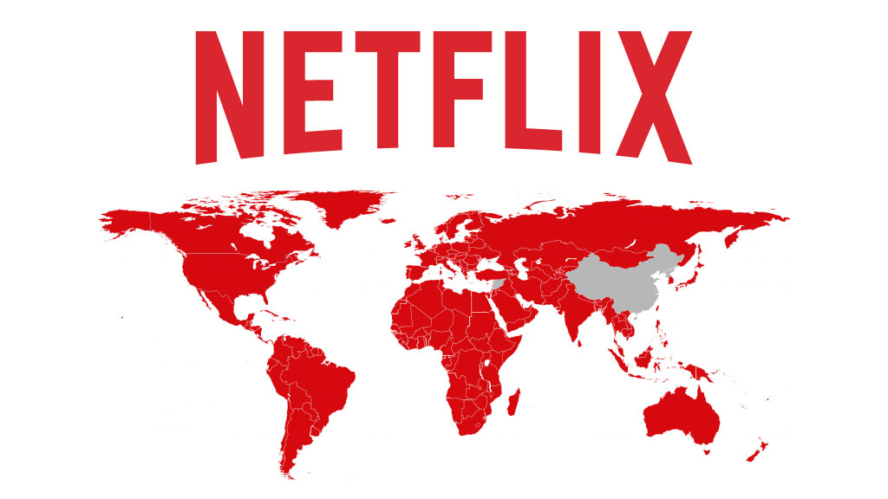
</p>

<p align="center"><sub>Figure 1. The object of study is a global catalog. Subscriber counts, ARPU, and watch-time are <em>out of sample</em>.</sub></p>

---

## 2. Research protocol (Stanford d.school)

The d.school Bootleg (2018) is explicit: the five modes are **not a waterfall**. Empathy findings get reopened when a test fails; a prototype can send you back to Define; Test is allowed to rewrite the Point of View. This study uses that loop as the spine of the analysis.

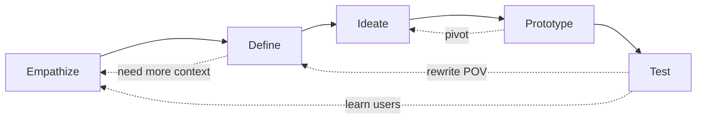
```mermaid
flowchart LR
  E[Empathize] --> D[Define]
  D --> I[Ideate]
  I --> P[Prototype]
  P --> T[Test]
  T -.->|"rewrite POV"| D
  T -.->|"learn users"| E
  P -.->|"pivot"| I
  D -.->|"need more context"| E
```

<p align="center">
  
</p>

<p align="center"><sub>Figure 2. Design thinking as an iterative research protocol (Empathize → Define → Ideate → Prototype → Test, with return paths).</sub></p>

---

### 2.1 Empathize — understand people before charts

**Empathize** (observe, engage, immerse) answers: *who is the catalog for, in what context, and what job are they hiring Netflix to do?*

This file contains **no user IDs, sessions, or ratings-as-stars**. Empathy therefore has to be built from (a) catalog structure as a proxy for *who was designed for*, and (b) the household viewing situation the product actually sits in.

<p align="center">
  
</p>

<p align="center"><sub>Figure 3. Empathy context: Netflix is often a shared living-room object, not only a personal mobile session. A mature-skewed catalog and a family co-viewing job are in tension.</sub></p>

**Stakeholders (jobs-to-be-done, not personas-as-decoration)**

| Stakeholder | Job to be done | What this catalog *can* show | What it *cannot* show |
|---|---|---|---|
| Household / family viewer | Find something everyone can watch tonight | Share of family-adjacent ratings; children’s genres | Whether families actually watch those titles |
| 16–34 individual subscriber | Endless personalization of mature drama, anime, reality | Density of TV-MA / TV-14; international and niche tags | Completion rate, binge depth, churn |
| Regional commissioning | “Local for global” hits that travel | Production-country credits; genre × country mix | Production cost, cultural authenticity, export lift |
| Content finance | Spend where catalog mix is thin *and* strategically valuable | Where inventory is thick or thin | ROI, first-28-day views, retention lift |
| Competitor strategy | Where Netflix is over-indexed vs. a family-first or prestige-thin catalog | Maturity mix; original-era volume (via `date_added`) | Competitor libraries (not in this file) |

**Empathy insight (evidence-bounded).**  
The catalog’s rating architecture is built primarily for **teen and adult individual viewing**. That is a defensible product bet for a streaming-first brand. It is also a **household-coverage risk** against a family-first competitor. The insight is about *inventory design*, not about what any age group “prefers.”

**What we deliberately did *not* do in Empathize.**  
We did not invent psychographic quotes, did not treat `rating` as audience review scores, and did not treat `country` as filming location. `rating` is a **parental-guideline / MPAA-style maturity label**. `country` is a **production-credit field**, often multi-valued.

---

### 2.2 Define — Point of View and How Might We

**Define** unpacks empathy into needs and insights, then writes a **Point of View (POV)** — a design vision scoped to a specific user — and a set of **How Might We (HMW)** questions. A POV that cannot be wrong is not a POV.

**POV (d.school form: user / need / insight)**

> **A multi-generational household** needs **a catalog they can co-view without a second subscription**, because **Netflix’s 2021 library is engineered around mature individual titles (TV-MA + TV-14 ≈ 61%) while the living-room job is shared attention** — and this dataset can evidence the *supply* side of that tension, not the demand side.

**Secondary POVs (held, not all prototyped equally)**

- A **regional commissioner** needs **visible concentration and missingness in country credits**, because “top countries” charts that silently drop 831 missing `country` values (9.4%) overstate U.S. dominance.
- A **personalization PM** needs **genre treated as a many-to-many tag, not a single label**, because titles carry on average **2.19** `listed_in` tags (max 3) and single-label bar charts double-count if exploded without saying so.

**How Might We (the questions the prototype is allowed to answer)**

| ID | HMW | Analytic translation |
|---|---|---|
| HMW-1 | How might we see catalog *growth as a policy*, not a vibe? | Time series of `date_added` vs. `release_year`, split by `type` |
| HMW-2 | How might we see geographic concentration **including unknown production**? | Exploded country credits + explicit unknown bucket |
| HMW-3 | How might we see maturity mix as a **strategic position**, not a bar chart of labels? | Rating distribution; rating × year; rating × genre |
| HMW-4 | How might we respect multi-genre reality? | One-title-to-many-genre grain (`netflix_titles_genres_split.csv`) |
| HMW-5 | How might we stop claiming “users prefer X”? | Explicit non-claims (Section 6) on every insight card |

**Research questions (falsifiable)**

- **RQ1.** Did Netflix’s *additions* (`date_added`) accelerate after mid-2010s global expansion, and is 2021 a complete year?
- **RQ2.** How concentrated are production credits, and how sensitive is the ranking to missing `country`?
- **RQ3.** Is the catalog maturity-skewed, and did that skew intensify over add-years?
- **RQ4.** Which genre tags dominate, and which co-locate with mature ratings?
- **RQ5.** Is “family content is scarce” a catalog fact, a mapping artifact, or both?

---

### 2.3 Ideate — flare before focus

**Ideate** is *quantity then quality*. We generated more views than we kept. The discarded ones matter: they document analytic hygiene.

**Ideas we kept (and why)**

| Prototype view | Why it survived ideation |
|---|---|
| Titles added by year | Distinguishes **library age** (`release_year`) from **acquisition/commissioning tempo** (`date_added`) |
| Type split (Movie / TV Show) | Movies and series are different products; pooling them hides strategy |
| Exploded countries | 1,320 titles list multiple countries; a “first country only” chart would be a silent bias |
| Genre explode + age band | Required for HMW-4; documented as a **derived grain**, not the title grain |
| Rating × genre heatmap | Tests whether mature ratings are uniform or genre-specific |
| Cast volume by genre | Weak but legitimate *production-style* signal (ensemble vs. lean), **not** star power |

**Ideas we killed (and why that is the professional move)**

| Idea | Why it died |
|---|---|
| “Teens prefer anime” from TV-14 × Anime cells | **Construct error**: a tag on a title is not a preference of an age cohort |
| ROI / LTV / churn dashboards | **No measures** in the file (no cost, no views, no subscribers) |
| Mean-imputation of numeric fields | There is no meaningful continuous field to impute; duration is typed text (`90 min` / `2 Seasons`) |
| Treating missing director as MCAR for TV Shows | Director is missing for **91.4% of TV Shows** vs **3.1% of Movies** — that is a **schema/practice difference**, not a hole to fill |
| Word clouds of `description` | High decoration, low decision value for this brief |
| Competitor subscriber / ARPU infographics as “findings” | Those numbers are **not in this dataset** and age immediately |

The chalkboard flowchart in `Tableau/` is kept as an **empathy object** (Netflix as a time-use decision), not as a causal model.

<p align="center">
  
</p>

<p align="center"><sub>Figure 4. Empathy object: Netflix as a time-use decision. It is not a data-generating process for the catalog file.</sub></p>

---

### 2.4 Prototype — the Tableau workbook as decision object

d.school: *a prototype is anything that takes a form people can react to.* The prototype here is not a recommendation engine. It is a **decision dashboard**: a shared object a strategy meeting can point at.

**Workbook:** [`Tableau/Netflix & TV Show.twbx`](./Tableau/Netflix%20&%20TV%20Show.twbx)

**Grain of each layer**

| Layer | Grain | File |
|---|---|---|
| Title catalog (analytic) | one row = one `show_id` | `data/processed/netflix_titles.csv` (NULLs preserved) |
| Title catalog (BI) | one row = one `show_id` | `data/processed/netflix_titles_tableau.csv` (English `Unknown`) |
| Genre credit | one row = one (`show_id`, genre tag) | `data/processed/netflix_title_genres.csv` |
| Country credit | one row = one (`show_id`, country) | `data/processed/netflix_title_countries.csv` |

**Interaction design (what “prototype” means in BI)**

- Filters: `type`, `rating`, `listed_in`, country, `release_year`, year of `date_added`
- A viewer should be able to **falsify a headline** (e.g. “Korea is rising”) by changing windows, not only consume a PNG

<p align="center">
  
</p>

<p align="center"><sub>Figure 5. Integrated prototype. Read it as a hypothesis workspace, not a poster of conclusions.</sub></p>

---

### 2.5 Test — prototype as if you’re right, test as if you’re wrong

**Test** puts the prototype in a decision context and asks what *breaks*.

| Test | Course prototype | After this pipeline |
|---|---|---|
| Can we claim “peak in 2021”? | Over-claims a truncated year | **Closed.** Add-year figure marks 2021 as right-censored; peak is 2019. |
| Can we rank countries without an Unknown bucket? | `Không xác định` sat in Top 10 | **Closed** in Python ranking (831 titles excluded). Tableau PNGs still show the old extract. |
| Can we treat `rating` as quality? | Three Louis C.K. runtimes sat in `rating` | **Closed.** Recoded; `rating_was_duration` flag; tests lock it. |
| Does a derived band recover “family”? | `TV-G` dumped into Other | **Closed.** Published `maturity_band` codebook; `family_adjacent` = 23.4%. |
| Can we speak about “user segmentation by age”? | **Still fail — correctly.** No viewer ages exist. | Keep calling it `maturity_band`. |

Test looping back to Define is the point: the first prototype was wrong in specific, nameable ways; the publication layer is the second prototype.

---

## 3. Data, provenance, and wrangling

### 3.1 Source

| Item | Value |
|---|---|
| Corpus | [Shivam Bansal, *Netflix Movies and TV Shows*, Kaggle](https://www.kaggle.com/shivamb/netflix-shows) |
| Original compiler | Flixable (third-party Netflix search engine), not an official Netflix data dump |
| Unit of analysis (title layer) | Title (`show_id`), *not* a user, session, or country-year |
| N | **8,807** titles |
| Type split | Movie **6,131** (69.6%) · TV Show **2,676** (30.4%) |
| `release_year` span | 1925–2021 |
| `date_added` span | 2008-01-01 → **2021-09-25** (10 titles missing date added) |
| Duplicate `show_id` | 0 |
| Duplicate `title` | 1 (same title string, still unique IDs — inspect before any title-level join) |

This is **observational catalog metadata**. It is not a probability sample of global film/TV, not a panel of subscribers, and not a complete 2021 vintage.

### 3.2 Data dictionary (title grain)

| Field | Role | Notes a professional actually needs |
|---|---|---|
| `show_id` | Primary key | Stable in this extract (`s1`…); do not assume stability across Kaggle versions |
| `type` | Product form | `{Movie, TV Show}` only |
| `title` | Display name | Not a key |
| `director` | Person credit, comma-separated | **29.9% missing overall; 91.4% missing for TV Shows** — do not “clean” this into a fake complete field if you will model directors |
| `cast` | Person credits, comma-separated | 9.4% missing; exploding creates a person–title edge list |
| `country` | Production credits, comma-separated | 9.4% missing; 1,315 multi-country titles; **not** “filmed in” |
| `date_added` | Netflix availability date | Strings with leading spaces; parse with `strip`. Measures **when it joined the catalog**, not cinematic release |
| `release_year` | Original release year | Integer; can predate Netflix by decades (library licensing) |
| `rating` | Maturity label | MPAA / TV Parental Guidelines-style. **Not** a crowd score. Three Louis C.K. rows recoded in the pipeline |
| `duration` | Heterogeneous | Movies: `N min`. Shows: `N Season(s)`. Never average them |
| `listed_in` | Genre tags, comma-separated | 42 distinct tags after split; 1–3 tags per title |
| `description` | Short synopsis | Useful for NLP; unused as a KPI here |

### 3.3 Missingness (raw file)

| Field | Nulls | % | Pattern |
|---|---|---|---|
| `director` | 2,634 | 29.91 | Almost all TV Shows |
| `cast` | 825 | 9.37 | Higher on TV Shows (13.1%) than Movies (7.7%) |
| `country` | 831 | 9.44 | Higher on TV Shows (14.6%) than Movies (7.2%) |
| `date_added` | 10 | 0.11 | Small; drop or flag |
| `rating` | 4 | 0.05 | Plus 3 misfiled durations |
| `duration` | 3 | 0.03 | The same three Louis C.K. rows |

**Professional stance on missingness.**  
Filling `director` / `cast` / `country` with a display string is acceptable **for a dashboard that must not show blanks**. It is unacceptable as **statistical imputation**. Analytic tables keep `NULL`. The Tableau extract uses English `Unknown` only at the viz layer. Unknown is **never ranked as a producing country**.

### 3.4 Derived grains and maturity codebook

`data/processed/netflix_title_genres.csv` explodes `listed_in` (19,323 rows). Counts of genres are **tag incidences**, not title counts. International Movies (2,752) being “#1” means *most frequently tagged*, not “the most watched.”

| `maturity_band` | Ratings |
|---|---|
| Kids | `TV-Y`, `TV-Y7`, `TV-Y7-FV`, `G`, `TV-G` |
| Teens | `PG`, `TV-PG`, `TV-14` |
| Adults | `PG-13`, `R`, `NC-17`, `TV-MA` |
| Unrated | `NR`, `UR` |
| Unknown | null, including three recoded duration-swap rows |

`family_adjacent` = Kids plus `PG` / `TV-PG` (excludes `TV-14`). Full field list: [`docs/DATA_DICTIONARY.md`](./docs/DATA_DICTIONARY.md).

### 3.5 Cleaning protocol (implemented in `python -m netflix_catalog`)

1. Recode the three duration-in-`rating` rows (Louis C.K. specials) → `duration` restored, `rating` null, `rating_was_duration` flag.
2. Parse `duration` into `duration_value` + `duration_unit` (`minutes` \| `seasons`).
3. Parse `date_added` (strip) → `year_added`; treat 2021 as right-censored.
4. Explode countries **without** promoting missingness into a nation ranking (`country_unknown` flag).
5. Keep NULL in analytic tables; English `Unknown` only in `netflix_titles_tableau.csv`.
6. Tests in `tests/test_clean.py` lock these invariants (10 passing).

---

## 4. Evidence: Tableau library + publication figures

Every chart exported from the course workbook is below. The left (or first) image is the **Tableau prototype**. The second is the **Python publication figure**: same question, corrected grain, sentence title, missingness handled, source line.

Grammar: [`docs/VIZ_SPECS.md`](./docs/VIZ_SPECS.md). Voices on every view:

1. **Observation** — what the chart shows at the stated grain  
2. **Inference** — what that implies *about the catalog*  
3. **Non-claim** — what a reader is not allowed to conclude  

<p align="center">
  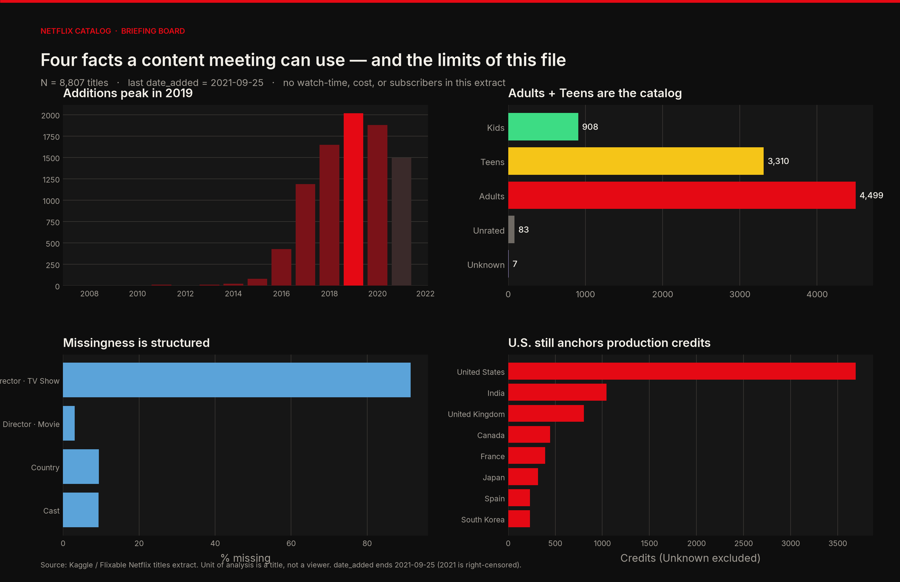
</p>

<p align="center"><sub>Publication briefing board (Python). Tableau’s integrated dashboard is next to it so the two prototypes can be compared.</sub></p>

<p align="center">
  
</p>

<p align="center"><sub>Tableau prototype · full dashboard. Some sheets still rank “Không xác định” as a country — that is why the Python ranking exists.</sub></p>

---

### 4.1 Catalog growth: add-policy vs library age

Tableau exported **Content by years** on `release_year`. The policy clock is `date_added`. Both belong in the argument.

<table>
<tr>
<td align="center" width="50%">
<br/>
<sub>Tableau · Content by years (release_year)</sub>
</td>
<td align="center" width="50%">
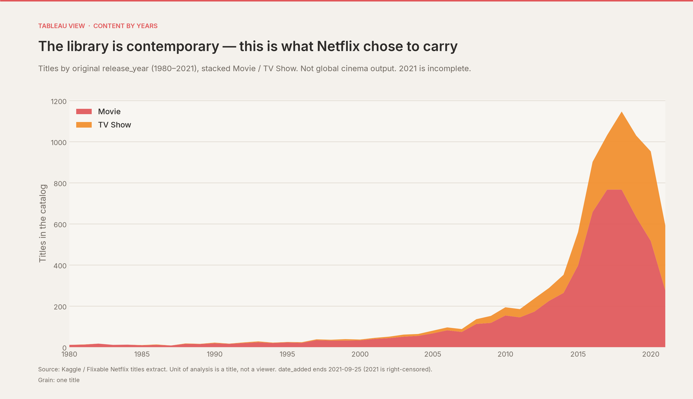<br/>
<sub>Publication · same question, Movie / TV Show stack</sub>
</td>
</tr>
</table>

<p align="center">
  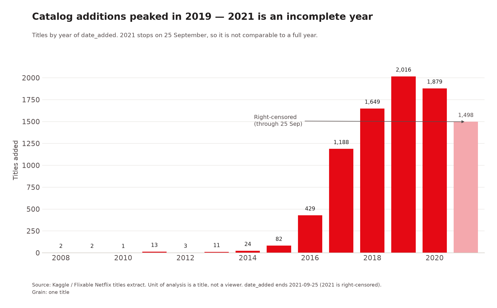
</p>

<p align="center"><sub>Publication · date_added (the commissioning clock Tableau did not isolate as a sentence title).</sub></p>

**Observation.** `date_added` peaks in **2019** (2,016 titles). 2021 (1,498) stops on 25 September. `release_year` is contemporary-heavy with a long left tail of licensed older films.

**Inference.** Do not read “content by years” as cinema output. It is **what Netflix chose to carry**. Add-year is the expansion tempo.

**Non-claim.** Not global production volume. 2021 cannot be compared to 2019 without an annualization this file does not support.

| Year of `date_added` | Titles added |
|---|---|
| 2016 | 429 |
| 2017 | 1,188 |
| 2018 | 1,649 |
| **2019** | **2,016** |
| 2020 | 1,879 |
| 2021 (through 25 Sep) | 1,498 |

---

### 4.2 Missingness is structured — keep NULL

<p align="center">
  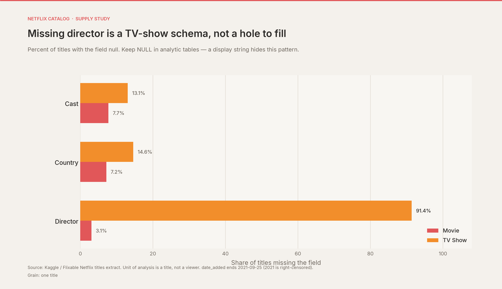
</p>

**Observation.** Director is missing for **91.4% of TV Shows** vs **3.1% of Movies**. Country and cast missingness is higher on series but still in the low teens.

**Inference.** TV-show director is a **schema/practice difference**, not a hole to fill.

**Non-claim.** Completeness of metadata is not a quality score for the title.

---

### 4.3 Production geography

<table>
<tr>
<td align="center" width="50%">
<br/>
<sub>Tableau · Top 10 producing countries</sub>
</td>
<td align="center" width="50%">
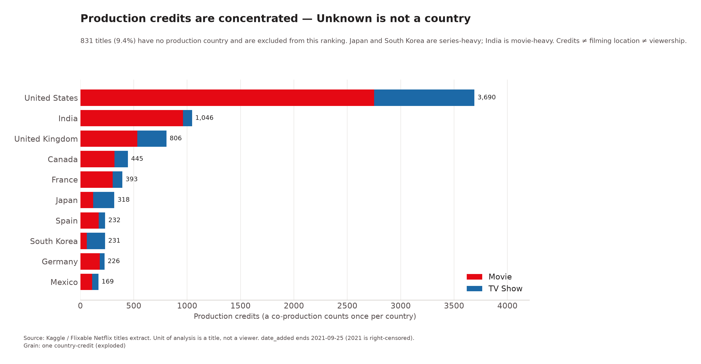<br/>
<sub>Publication · Unknown excluded (831 titles / 9.4%)</sub>
</td>
</tr>
</table>

<p align="center">
  
</p>

<p align="center"><sub>Tableau · Distribution of content by countries (choropleth). The map is the right form for geography; the ranking above is the honest Top 10.</sub></p>

**Observation.** United States 3,690 · India 1,046 · United Kingdom 806. Japan and South Korea are series-heavy; India is movie-heavy. 831 titles have no country credit.

**Inference.** Local-for-global is a **long tail of credits**, not a dethroning of the U.S.

**Non-claim.** Credit ≠ filming location ≠ the market that watched it.

---

### 4.4 Genre tags over time

<table>
<tr>
<td align="center" width="50%">
<br/>
<sub>Tableau · Trend in publishing genres (spaghetti)</sub>
</td>
<td align="center" width="50%">
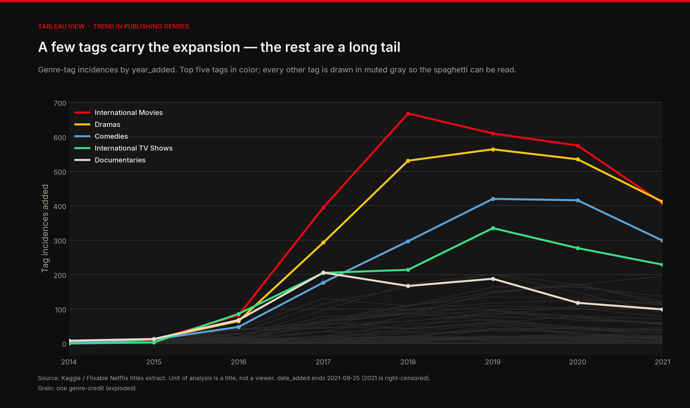<br/>
<sub>Publication · top five in color, long tail muted</sub>
</td>
</tr>
</table>

<p align="center">
  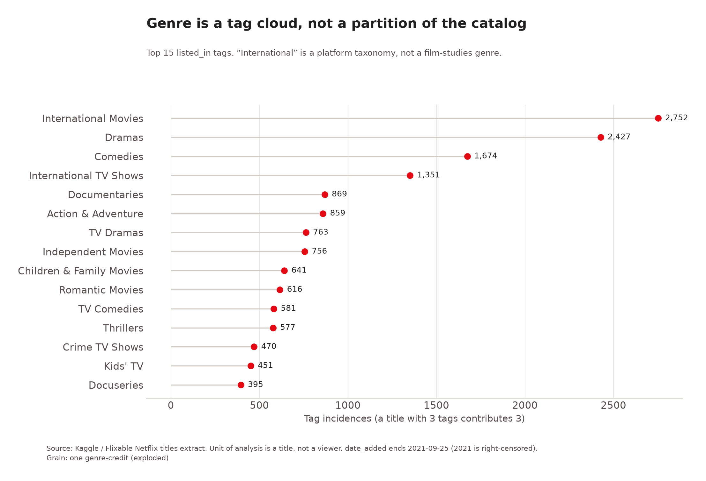
</p>

**Observation.** International Movies 2,752 · Dramas 2,427 · Comedies 1,674. Mean tags per title = **2.19**. A few tags carry the 2016–2019 expansion; the rest are a long tail.

**Inference.** “International” is a **platform taxonomy**. Drama + comedy are the mass spine.

**Non-claim.** Tag growth ≠ audience growth.

---

### 4.5 Maturity mix

<table>
<tr>
<td align="center" width="50%">
<br/>
<sub>Tableau · Number of content by rating</sub>
</td>
<td align="center" width="50%">
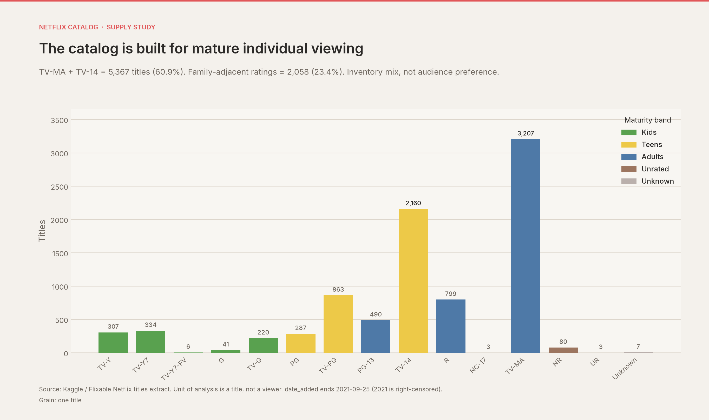<br/>
<sub>Publication · recoded ratings, maturity bands</sub>
</td>
</tr>
</table>

<table>
<tr>
<td align="center" width="50%">
<br/>
<sub>Tableau · Ratings over release years</sub>
</td>
<td align="center" width="50%">
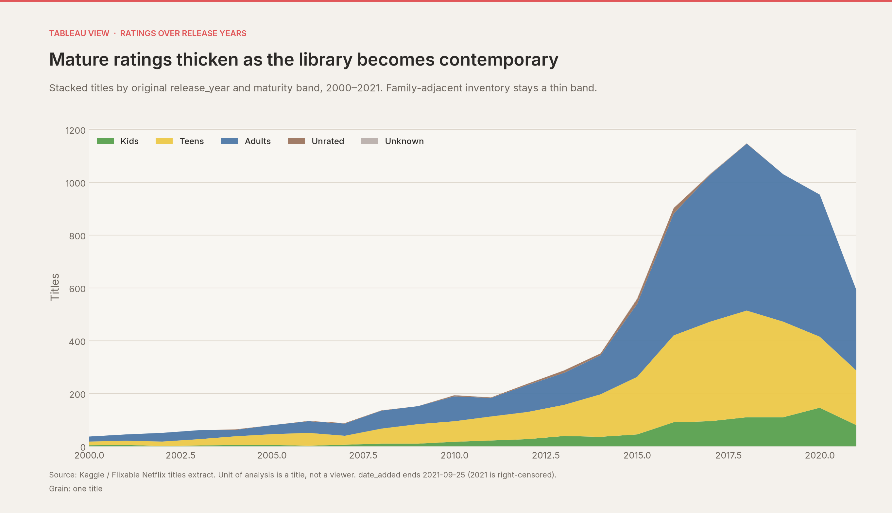<br/>
<sub>Publication · maturity bands, 2000–2021</sub>
</td>
</tr>
</table>

<p align="center">
  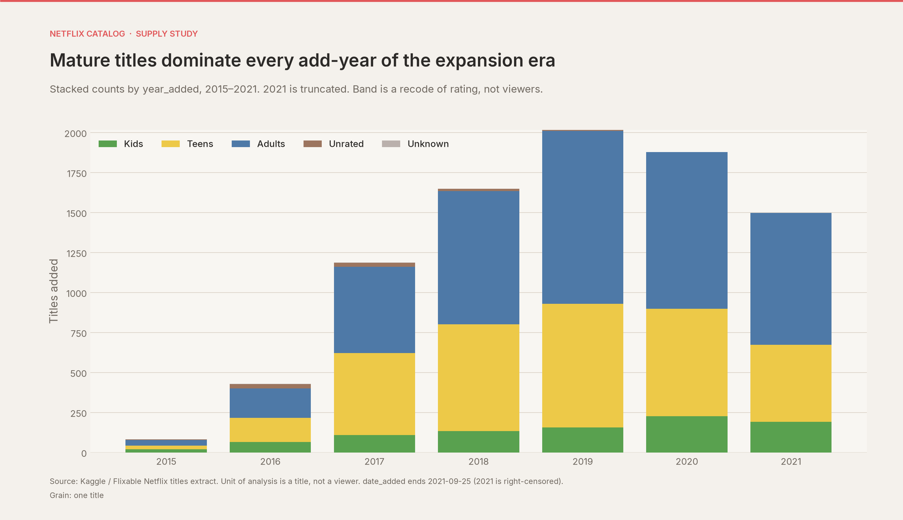
</p>

<p align="center"><sub>Publication · the same mix on the add-year clock (2015–2021).</sub></p>

**Observation.** TV-MA 3,207 · TV-14 2,160. Family-adjacent = **23.4%**. Mature bands dominate every expansion add-year.

**Inference.** The 2021 catalog is positioned as a teen/adult destination. Disney+ family contrast is a **positioning** claim, not a measurement of Disney’s library here.

**Non-claim.** “Users are mostly adults” does not follow from inventory mix.

---

### 4.6 Rating × genre

<table>
<tr>
<td align="center" width="50%">
<br/>
<sub>Tableau · Age-rating category “correlations”</sub>
</td>
<td align="center" width="50%">
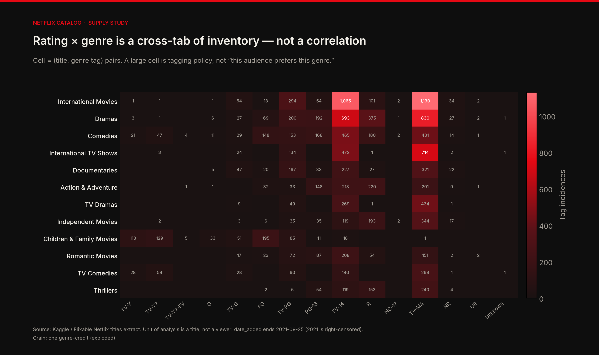<br/>
<sub>Publication · named as a cross-tab, not a correlation</sub>
</td>
</tr>
</table>

**Observation.** TV-MA × International Movies = 1,130 tag incidences; TV-14 × International Movies = 1,065.

**Inference.** Mature international drama is the **modal inventory cell**.

**Non-claim.** Cell size is tagging policy, not taste affinity. The Tableau filename says “correlations”; no coefficient is computed.

---

### 4.7 Cast × listed_in

<table>
<tr>
<td align="center" width="50%">
<br/>
<sub>Tableau · Cast × listed in</sub>
</td>
<td align="center" width="50%">
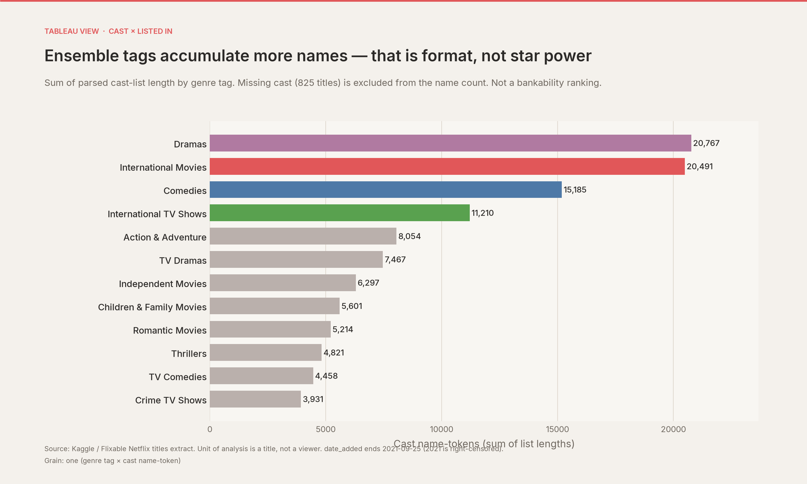<br/>
<sub>Publication · name-tokens, missing cast excluded</sub>
</td>
</tr>
</table>

**Observation.** Dramas and International Movies accumulate the most parsed cast names.

**Inference.** That is **format** (ensemble drama) more than star power. 825 titles have no cast list.

**Non-claim.** Not a talent graph or bankability ranking until names are resolved.

---

## 5. Synthesis

Design Thinking is supposed to end in a **sharper problem**, not a longer slide of recommendations.

### 5.1 What survived Test

1. **The catalog is a designed maturity position.** TV-MA + TV-14 dominance is too large to be a tagging accident.
2. **The growth era is dated.** Additions scale from 2016, peak in 2019 in this file, and cannot be scored for full-year 2021.
3. **Geography is a hub-and-spoke credit structure** with a material unknown class (9.4%).
4. **Genre must be modeled as multi-label.** Any “top genre” chart is an incidence chart.
5. **Family coverage is a supply question this file *can* answer; family *demand* is not.**

### 5.2 Implications (scoped to people who own catalogs)

These are **design implications for inventory**, not a Netflix strategy memo pretending to have P&L.

| Horizon | Move | Why this dataset supports it | What you must still measure |
|---|---|---|---|
| Immediate | Publish title-level **missingness dashboards** (`country`, `director` by `type`) | Missingness is large and structured | Nothing — this is free |
| Immediate | Stop ranking Unknown as a country; alias it in Tableau | 831 rows | — |
| Near | Run a **family-adjacent coverage** view (ratings + `Children & Family Movies` / `Kids' TV` tags) as a gap monitor | 23.4% family-adjacent ratings | Household accounts, kids profiles, co-viewing |
| Near | Treat India / Korea / Japan as **format-different poles** (films vs series) | Type × country stacks | Cost per hour, export hours watched |
| Later | Join this catalog to **restricted viewing data** (even a 1% sample) before any ROI language | Current file cannot | Views, completion, retention, cost |

<p align="center">
  
</p>

<p align="center"><sub>Figure 6. Competitive landscape is <em>context for Empathize</em>. Subscriber and ARPU figures are not estimated here and are not reproduced as findings.</sub></p>

---

## 6. What this study does *not* claim

A 10/10 data study is defined as much by **refused inferences** as by charts.

| Tempting sentence | Why it is invalid on this file |
|---|---|
| “Teens prefer anime / adults prefer drama” | No viewers, no ages. `maturity_band` is a title-level recode of `rating` |
| “Netflix should cut volume and chase ROI” | No cost, no hours viewed, no LTV |
| “Korea is winning because K-content is popular” | We see **title credits**, not hours watched in 2021 or after *Squid Game* |
| “Disney+ beats Netflix with families” | Disney’s catalog is not in the data; we only see Netflix’s family **supply** |
| “Ratings measure quality” | `rating` is a maturity label; three duration-swap rows are recoded in the pipeline |
| “The map is where titles were filmed” | Production credits, often co-production |

---

## 7. Threats to validity

| Threat | How it shows up | Mitigation in this write-up |
|---|---|---|
| **Construct validity** | Using catalog tags as “taste”; using `rating` as quality; using `maturity_band` as viewers | Section 6; codebook; tests |
| **Internal validity** | Reading `release_year` as Netflix strategy | Prefer `date_added` as the policy clock |
| **External validity** | Snapshot ends 2021-09-25; no ad-tier, no games, no 2022–2026 originals | Bound every claim to “in this extract” |
| **Measurement** | Multi-label explode inflates counts; multi-country explode double-credits | Always state grain |
| **Processing** | Localized fill-ins leak into “Top 10” | Analytic tables keep NULL; Python ranking excludes Unknown |
| **Selection** | Kaggle/Flixable is not Netflix’s internal title master; regional availability differs | Do not treat N = 8,807 as “the global product” |

---

## 8. Reproducibility and artifacts

```
.
├── data/raw/netflix_titles.csv              # immutable source extract
├── data/processed/                         # gold tables (NULL-preserving)
│   ├── netflix_titles.csv
│   ├── netflix_title_genres.csv
│   ├── netflix_title_countries.csv
│   ├── netflix_titles_tableau.csv
│   └── quality_report.md
├── data/dictionaries/                       # field + maturity codebooks
├── netflix_catalog/                        # clean → quality → viz
├── tests/test_clean.py                     # 10 wrangling invariants
├── figures/                                # 12 publication PNGs (Tableau-harmonious cream)
├── docs/                                   # dictionary, quality, viz specs
├── Tableau/Netflix & TV Show.twbx          # interactive prototype
└── Report/Report Project.pdf                # course report (HCMUS)
```

```bash
python -m pip install -r requirements.txt
python -m pytest -q
python -m netflix_catalog
```

**How to open the prototype.** Tableau Desktop / Tableau Public → `Tableau/Netflix & TV Show.twbx`. Point a refresh at `data/processed/netflix_titles_tableau.csv`. Alias `Unknown` as “No production country” and keep it out of Top 10.

**Course origin.** Studio project, *Data Visualization using Tableau*, Faculty of Information Technology, University of Science, VNU-HCM.

---

## 9. How to cite

Dataset:

> Bansal, S. (2021). *Netflix Movies and TV Shows* [Data set]. Kaggle. https://www.kaggle.com/shivamb/netflix-shows

This repository:

> Nguyen, T. H. (2021/2026). *Netflix Movies and TV Shows: A catalog-supply inquiry through Stanford Design Thinking* [Tableau workbook and working paper]. GitHub. https://github.com/TheHien04/Netflix-Movies-and-TV-Shows

**Methodological frame.** Hasso Plattner Institute of Design at Stanford (d.school). (2018). *Design Thinking Bootleg*.

**License of this write-up.** Academic / educational use. The Kaggle dataset has its own license on the source page; this repo does not re-license Netflix’s titles.

---

## Author

**Nguyen The Hien ([TheHien04](https://github.com/TheHien04))**  
Data analysis · Tableau · catalog methodology  

**Tools in this artifact.** Python/pandas (wrangling), matplotlib (publication figures), pytest (invariants), Tableau (interactive prototype).

---

<sub>Design thinking contribution, stated in one sentence: the work is not “we made eight charts”; it is “we specified who the catalog is for, wrote a POV that can be wrong, killed inferences the file cannot support, and left a prototype that makes those limits visible.”</sub>
