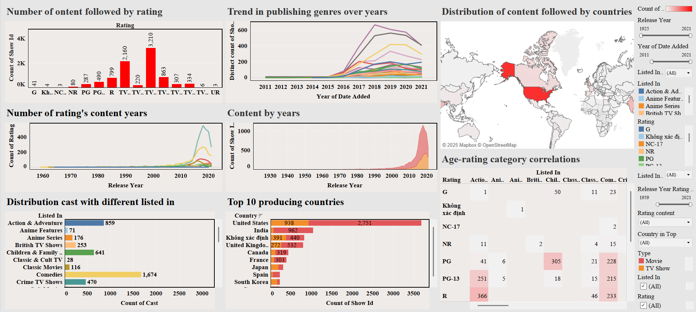

# 🎬 Netflix Movies and TV Shows – Data Visualization with Tableau
  
This project delivers a professional **data analysis and visualization of Netflix Movies & TV Shows** using Tableau.  
As streaming platforms compete fiercely worldwide, this analysis provides actionable insights into **content growth, genre shifts, audience targeting, and market competition**.  
By combining Tableau with **Design Thinking**, we highlight both descriptive analytics (what has happened) and strategic implications (what Netflix should do).

---

## 🌍 Background: Netflix and the Streaming War

Founded in 1997 as a DVD rental service, Netflix is now the **largest global streaming platform** with over 240M subscribers across 190+ countries. Its strategy focuses on:

- **Worldwide Reach** 🌐 – Rapid expansion post-2015 with localized content.  
- **Original Productions** 🎥 – Heavy investment in Netflix Originals since 2013.  
- **Competition** ⚔️ – Disney+, Amazon Prime, and Hulu are rising challengers.  
- **User Segmentation** 👥 – Diverse audiences by age, geography, and genre affinity.  

  

---

## 📊 Domain Insights and Visualizations

### 1. Content Growth Over Time

- Netflix’s catalog **expanded sharply post-2015**, peaking in 2018–2020.  
- This aligns with Netflix’s international push into Asia and Europe.  
- Content growth **stabilized post-2021**, signaling a shift from volume ➝ quality.  

---

### 2. Publishing Trends by Genre

- **Drama, Comedy, and International Movies** dominate Netflix’s portfolio.  
- Genres like **Anime and Docuseries** surged post-2017, meeting niche demands.  
- Reflects Netflix’s strategy: **“something for everyone”**.  

---

### 3. Distribution by Country

  

- The **US leads** content supply, but **India and the UK** are fast followers.  
- **South Korea and Japan** grew significantly with K-dramas and Anime.  
- Localized production = key to winning regional markets.  

---

### 4. Ratings and Audience Targeting

  

- **TV-MA and TV-14 dominate** ➝ Netflix focuses on **mature + teen audiences**.  
- **Family-friendly content** (G, PG) is minimal ➝ a gap where Disney+ excels.  
- Rating growth post-2015 shows Netflix betting on **edgy, bold storytelling**.  

---

### 5. Cast & Production Depth

- Cast networks are strongest in **Dramas, International Movies, and Comedies**.  
- Indicates investment in **character-driven, story-heavy productions**.  
- Expanding collaborations with international stars broaden Netflix’s reach.  

---

### 6. Age-Rating and Genre Correlation

- **TV-MA x International Movies**: 1,457 titles ➝ mature global content.  
- **R x Dramas**: 595 titles ➝ traditional movie markets.  
- **TV-14 x International Shows**: 1,195 titles ➝ teen-focused series boom.  

**Insight:** Netflix balances **youth appeal + mature niche dominance**.  

---

### 7. User Segmentation

- **Teens (13–24)** prefer Anime, Action, Sci-Fi.  
- **Adults (25–44)** watch Drama, Documentaries.  
- **Families (45+)** lean on International Movies and Comedies.  
- **Key insight:** Personalized recommendations must vary **by age & culture**.  

---

## 🔄 Netflix Strategic Flow & Design Thinking

### Flow of Analysis

- Start: **Content supply (countries, genres)**  
- Process: **Ratings & user segmentation**  
- End: **Strategic insights for competition & engagement**  

### Applying Design Thinking

1. **Empathize** – Identify user needs (local content, genre preference).  
2. **Define** – Spot challenges (e.g., limited family content vs Disney+).  
3. **Ideate** – Propose ideas (regional co-productions, niche genres).  
4. **Prototype** – Create dashboards & simulate content strategies.  
5. **Test** – Measure success with engagement & retention metrics.  

---

## 🛠 Tools & Workflow
- **Tableau Desktop** – Main dashboard design.  
- **Python (Pandas)** – Data cleaning & preprocessing.  
- **SQL** – Structured queries for segmentation.  
- **Visualization Assets** – Charts, flowcharts, and storytelling graphics.  

---

## 📈 Executive Insights

- Netflix dominates **mature-rated global content** but risks losing **family market**.  
- **India, South Korea, Japan** are growth engines ➝ invest in local originals.  
- Competitors like Disney+ win families ➝ Netflix must close that gap.  
- **User segmentation** shows personalization is critical to retention.  
- Applying **Design Thinking** transforms data into actionable strategy.  

---

## 📊 Final Integrated Dashboard

- Interactive filters for ratings, genres, and regions.  
- Unified storytelling: Content growth ➝ Ratings ➝ Countries ➝ Segmentation.  
- Built for both **analytical exploration** and **executive reporting**.  

---

## 👨‍💻 Author

- **Author**: [TheHien04](https://github.com/TheHien04)  
- **Role**: Data Analyst | Tableau Developer  
- **Dataset**: [Kaggle Netflix Titles](https://www.kaggle.com/shivamb/netflix-shows)  
- **License**: Academic & educational purposes  

---

⭐ Star this repo if you find it useful, or fork to extend with predictive modeling!  
