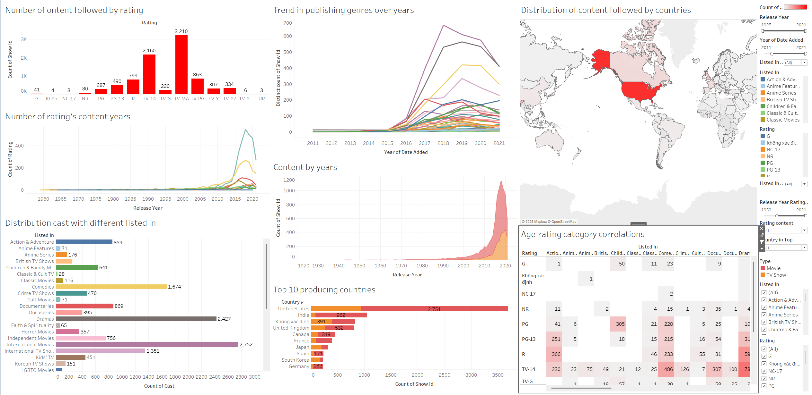

# 🎬 Netflix Movies and TV Shows – Data Visualization with Tableau

This project aims to analyze and visualize the Netflix Movies and TV Shows dataset using Tableau. By cleaning, transforming, and exploring the dataset, we provide key insights into global streaming content trends, genre distribution, rating patterns, and regional production activities. The analysis concludes with a comprehensive Tableau dashboard.

---

## 📁 Repository Structure

The project is organized as follows:

- `/Report`: Contains the final report in PDF format.
- `/Tableau`: Includes the Tableau workbook (`.twbx`) and all exported visualization images.
- `netflix_titles.csv`: Original raw dataset from Kaggle.
- `netflix_titles_cleaned.csv`: Cleaned and normalized dataset used in visualization.
- `netflix_titles_genres_split.csv`: Genre-split version for detailed analysis.
- `README.md`: Documentation of the project.

---

## 📦 Dataset Overview

- **Source**: [Kaggle - Netflix Movies and TV Shows](https://www.kaggle.com/shivamb/netflix-shows)
- **Size**: ~8,800 entries
- **Fields**: Title, Type (Movie/TV), Country, Genre, Date Added, Rating, Release Year, Director, Cast, etc.
- **Cleaning Steps**: 
  - Removed nulls in essential fields.
  - Standardized genre list.
  - Split multiple genres into separate rows.
  - Normalized country and rating values for grouping.

---

## 📊 Task-by-Task Visualization Summary

### 1. Content Growth Over Time

The number of content releases grew exponentially after 2015. Netflix's expansion strategy is clearly visible, with a peak around 2018–2020.

---

### 2. Trend in Publishing Genres Over Years

Dramas, International Movies, and Comedies emerged as dominant genres. A rapid spike is observed between 2016–2019, aligning with Netflix's international expansion.

---

### 3. Distribution of Content by Country

The United States leads content production by a wide margin, followed by India, the United Kingdom, and Canada. Emerging contributions from France, South Korea, and Japan are also observed.

---

### 4. Number of Content by Rating

Ratings like **TV-MA** and **TV-14** dominate, indicating a significant focus on content for mature and teen audiences. Ratings such as **G**, **NC-17**, and **UR** are rare.

---

### 5. Rating Distribution by Release Year

Most ratings only gained volume post-2010. TV-MA and TV-14 content show a dramatic rise, particularly between 2015 and 2020. This reinforces Netflix's investment in edgy, mature-themed content.

---

### 6. Cast Distribution by Genre

Genres like Dramas, International Movies, and Comedies have the highest number of actors involved, showing strong investment in character-driven narratives and international appeal.

---

### 7. Top 10 Content Producing Countries

The United States dominates both movies and shows. India and the United Kingdom have a higher ratio of TV Shows compared to Movies. This reflects regional media consumption trends.

---

### 8. Age-Rating and Genre Correlation

Strongest correlations:
- **TV-MA** & International Movies: 1,457 titles
- **R** & Dramas: 595 titles
- **TV-14** & International TV Shows: 1,195 titles

This confirms that Netflix prioritizes mature global content across diverse categories.

---

### 9. Final Integrated Dashboard

A unified Tableau dashboard presents:
- Rating breakdown
- Year-wise genre trends
- Country-based distribution
- Genre-rating heatmap
- Cast participation by genre
All filters and views are interactive for exploratory data analysis.

---

## 💡 Conclusion

Through this project, we successfully explored Netflix’s strategic direction in content creation. Key takeaways include:
- Emphasis on mature-rated content (TV-MA, R)
- Genre shifts post-2015 aligned with globalization
- US remains dominant but India and UK rise in production
- Data-driven insights aid in understanding viewer targeting and market expansion

---

## 👨‍💻 Author & Credit

- **Author**: [TheHien04](https://github.com/TheHien04)
- **Tool**: Tableau Desktop
- **Data Source**: Kaggle Netflix Titles Dataset
- **Language**: English
- **License**: For academic and educational purposes

---

⭐ Star this repository if you found the project useful, and feel free to fork or contribute!
