# Netflix Movies and TV Shows

### The catalog as designed supply  
**A visualization study through Stanford Design Thinking and Munzner’s nested model**

---

**Ho Chi Minh City University of Science (VNU-HCM)**  
Faculty of Information Technology · *Data Visualization using Tableau*

| | |
|---|---|
| Instructor | Nguyễn Ngọc Minh Châu |
| Group | 22HTTT · Group 11 |
| Authors | Nguyễn Thế Hiển (22127107, lead) · Bùi Công Mậu (22127260) · Nguyễn Trần Đại Quốc (22127355) · Thái Hữu Thọ (22127400) |
| Corpus | Flixable / Kaggle Netflix titles, *N* = 8,807 |
| Window | `date_added` 2008-01-01 → **2021-09-25** (2021 right-censored) |
| Prototype | `Tableau/Netflix & TV Show.twbx` |
| Publication layer | `python -m netflix_catalog` → `figures/viz_*.png` |
| This document | Archival academic rewrite of the studio report |

The file `Report Project.pdf` is the original studio submission. It is retained as a historical artifact. **This markdown report supersedes it.** Construct errors in the PDF (rating-as-reviews, country-as-filming-location, mean-imputation of non-numeric fields, ranking “Không xác định” as a country, and leftover heart-disease evaluation text) are corrected here.

---

## Abstract

A public catalog of titles is not a panel of viewers. This study treats the Flixable/Kaggle Netflix titles extract (*N* = 8,807; last `date_added` = 25 September 2021) as a **designed supply object**: the set of works a platform chose to license, produce, and surface. We use the Stanford d.school’s five modes (Empathize, Define, Ideate, Prototype, Test) as the *research protocol* and Munzner’s nested model (domain → data/task abstraction → idiom → algorithm) as the *visualization protocol*.

The interactive prototype is a Tableau workbook. The publication layer is a Python pipeline that keeps `NULL` in analytic tables, recodes three duration-in-`rating` rows, explodes multi-label country and genre credits at a documented grain, and redraws each course chart with sentence titles, source lines, and a palette sampled from the workbook (cream `#EFEBE8`, Movie `#E15658`, TV Show `#F28B25`).

**Primary result.** By 2021 the catalog is **mature-skewed and geographically concentrated**. Movies are 69.6% of titles (6,131 / 8,807). TV-MA + TV-14 account for 60.9% of titles. Family-adjacent ratings are 23.4%. Exploded production credits are headed by the United States (3,690), India (1,046), and the United Kingdom (806). If missing country is promoted to a nation label, **Unknown ranks third (831 credits, 9.4% of titles)** — which is why the Python ranking excludes it. Additions (`date_added`) peak in 2019 (2,016 titles); 2021 is truncated.

**Keywords:** catalog analytics, construct validity, missingness, unit of analysis, design thinking, nested model, Tableau, reproducibility.

---

## How to read the dual evidence

Every domain task below is shown as **two panels**:

| Column | Role |
|---|---|
| **Left — Tableau** | Course prototype: interactive, filterable, the object a meeting can point at. Some sheets still reflect the studio extract (Vietnamese `Không xác định`, duration strings in `rating`). |
| **Right — Python** | Publication figure: same *question*, corrected grain, sentence title, missingness handled, source line, Tableau-harmonious color. |

A few views exist on only one side, and that is stated: missingness is a Python diagnostic the workbook never isolated; the choropleth is kept as Tableau because a map is the right idiom for geography.

Grammar on every result card:

1. **Observation** — what the chart shows at the stated grain  
2. **Inference** — what that implies *about the catalog*  
3. **Non-claim** — what a reader is not allowed to conclude  

---

## 1. Introduction

### 1.1 Design challenge

Netflix’s public identity is personalization. The file in this repository is the opposite of a recommendation log: it is a **title-level catalog snapshot**. Using it as an audience study produces the most common error in student (and industry) streaming analytics: **inferring preference from inventory**.

> How might a content, product, or regional team **see the catalog as a designed object** — its growth, geography, maturity mix, and genre architecture — without pretending the file contains viewers?

That is an ill-structured problem. Stanford Design Thinking exists for those. Munzner’s nested model exists so that a wrong *domain* question is not laundered by a pretty *idiom*.

<p align="center">
  
</p>
<p align="center"><sub>Figure 1. Object of study: a global catalog. Subscriber counts, ARPU, and watch-time are out of sample.</sub></p>

### 1.2 Contributions

1. A **construct-correct dictionary**: `rating` is a parental-guideline / MPAA-style maturity label, not a crowd score; `country` is a production-credit field, not filming location; `date_added` is catalog-entry time, not cinematic release.
2. A **cleaning protocol that refuses cosmetic completeness**: analytic tables keep `NULL`; English `Unknown` exists only in the Tableau extract; Unknown is never ranked as a producing country.
3. A **dual prototype**: Tableau for interaction, Python for publication claims that can survive Test.
4. Explicit **non-claims** and threats to validity, which we treat as part of the result, not an appendix apology.

### 1.3 What this paper is not

It is not a viewer study, a cost study, or a 2022–2026 originals tracker. Claims are bound to this extract.

---

## 2. Related work and theoretical frame

**Catalog versus demand.** Media-industry research (e.g. Lotz on internet-distributed television) distinguishes *what a service carries* from *what a household watches*. This extract can speak to the former. Treating `listed_in` tag volume as “what teens prefer” is a construct error, not a small caveat.

**Design thinking as protocol, not poster.** The Hasso Plattner Institute of Design at Stanford (d.school, *Design Thinking Bootleg*, 2018) specifies five *modes* with return paths. Empathy findings reopen when a test fails. We use that loop as the spine of the analysis, not as a cover illustration.

**Nested model for visualization.** Munzner (2014) separates domain situation, data/task abstraction, visual encoding, and algorithm. A failure at a higher level cannot be rescued by a lower one: a heatmap named “correlations” that computes no coefficient is an abstraction failure, regardless of color scale. Mackinlay’s (1986) expressiveness/effectiveness criteria and Cleveland & McGill’s ranking of perceptual tasks (position ≫ length ≫ area ≫ color) govern idiom choice in Section 6.

**Missingness as signal.** Rubin’s taxonomy (MCAR / MAR / MNAR) is the reason we do not fill TV-show `director` with a display string and then “profile completeness = 100%.” Director missingness is 91.4% for TV Shows versus 3.1% for Movies: a schema/practice difference, not a hole.

---

## 3. Research protocol (Stanford d.school)

The five modes are not a waterfall.

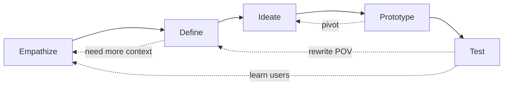

<p align="center">
  
</p>
<p align="center"><sub>Figure 2. Iterative protocol used as the research spine.</sub></p>

### 3.1 Empathize

This file contains no user IDs, sessions, or star ratings. Empathy is built from (a) catalog structure as a proxy for *who was designed for*, and (b) the household situation the product sits in.

<p align="center">
  
</p>
<p align="center"><sub>Figure 3. Empathy context: Netflix is often a shared living-room object. A mature-skewed catalog and a family co-viewing job are in tension.</sub></p>

| Stakeholder | Job to be done | What this catalog *can* show | What it *cannot* show |
|---|---|---|---|
| Household / family viewer | Find something everyone can watch tonight | Share of family-adjacent ratings; children’s tags | Whether families watch those titles |
| 16–34 individual subscriber | Personalized mature drama, anime, reality | Density of TV-MA / TV-14; niche tags | Completion, binge depth, churn |
| Regional commissioning | Local-for-global titles that travel | Production-country credits; type × country | Cost, authenticity, export lift |
| Content finance | Where mix is thin *and* valuable | Inventory thickness | ROI, first-28-day views |
| Competitor strategy | Over-index vs a family-first catalog | Maturity mix; add-year volume | Competitor libraries |

**Empathy insight (evidence-bounded).** The rating architecture is built primarily for teen and adult *individual* viewing. That is a product bet. It is also a household-coverage risk against a family-first competitor. The insight is about inventory design, not preference.

### 3.2 Define — Point of View and How Might We

A POV that cannot be wrong is not a POV.

> **A multi-generational household** needs **a catalog they can co-view without a second subscription**, because **Netflix’s 2021 library is engineered around mature individual titles (TV-MA + TV-14 ≈ 61%) while the living-room job is shared attention** — and this dataset can evidence the *supply* side of that tension, not the demand side.

Secondary POVs: a regional commissioner needs unknown production credits visible (831 titles, 9.4%); a personalization PM needs genre treated as many-to-many (mean 2.19 tags per title).

| ID | How Might We | Analytic translation |
|---|---|---|
| HMW-1 | See growth as policy, not vibe? | `date_added` vs `release_year`, split by `type` |
| HMW-2 | See geographic concentration **including unknown production**? | Exploded credits + explicit unknown bucket |
| HMW-3 | See maturity mix as strategic position? | Rating; rating × year; rating × genre |
| HMW-4 | Respect multi-genre reality? | Genre-credit grain `data/processed/netflix_title_genres.csv` |
| HMW-5 | Stop claiming “users prefer X”? | Non-claims on every insight card |

**Research questions (falsifiable)**

- **RQ1.** Did additions (`date_added`) accelerate after mid-2010s expansion, and is 2021 complete?  
- **RQ2.** How concentrated are production credits, and how sensitive is the ranking to missing `country`?  
- **RQ3.** Is the catalog maturity-skewed, and did that skew hold across add-years?  
- **RQ4.** Which genre tags dominate, and which co-locate with mature ratings?  
- **RQ5.** Is “family content is scarce” a catalog fact, a mapping artifact, or both?

### 3.3 Ideate — what we kept and killed

Kept: add-year vs release-year; type split; exploded countries; genre explode; rating × genre as a *cross-tab*; cast-token volume as a production-style signal.

Killed: “teens prefer anime” from a TV-14 × Anime cell; ROI/LTV dashboards (no measures); mean-imputation (no meaningful continuous field); treating TV-show director as MCAR; word clouds; competitor ARPU as a *finding*.

<p align="center">
  
</p>
<p align="center"><sub>Figure 4. Empathy object (time-use decision). Not a data-generating process for the catalog file.</sub></p>

### 3.4 Prototype

d.school: a prototype is anything people can react to. Here it is a **decision dashboard**, not a recommender.

| Layer | Grain | File |
|---|---|---|
| Title catalog (analytic) | one `show_id` | `data/processed/netflix_titles.csv` (NULLs preserved) |
| Title catalog (BI) | one `show_id` | `data/processed/netflix_titles_tableau.csv` (English `Unknown`) |
| Genre credit | (`show_id`, tag) | `data/processed/netflix_title_genres.csv` (19,323 rows) |
| Country credit | (`show_id`, country) | `data/processed/netflix_title_countries.csv` (10,012 rows) |

Filters in the workbook: `type`, `rating`, `listed_in`, country, `release_year`, year of `date_added`. A viewer should be able to **falsify a headline** by changing windows.

### 3.5 Test

| Test | Studio prototype | After this pipeline |
|---|---|---|
| Peak in 2021? | Over-claims a truncated year | Closed. Peak add-year is 2019; 2021 marked right-censored. |
| Rank countries without Unknown? | `Không xác định` in Top 10 | Closed in Python (831 titles excluded). Tableau PNGs still show the old extract. |
| `rating` as quality? | Three Louis C.K. runtimes in `rating` | Closed. Recoded; `rating_was_duration`; tests lock it. |
| Derived band recovers “family”? | `TV-G` dumped into Other in some studio maps | Closed. Published codebook; `family_adjacent` = 23.4%. |
| User segmentation by age? | Still fail — correctly | No viewer ages exist. Keep calling it `maturity_band`. |

---

## 4. Data, provenance, and methods

### 4.1 Source

| Item | Value |
|---|---|
| Corpus | Bansal, S. (2021). *Netflix Movies and TV Shows*. Kaggle. Originally compiled by Flixable, not an official Netflix dump. |
| Unit of analysis (title layer) | Title (`show_id`), *not* a user, session, or country-year |
| *N* | **8,807** titles · Movie **6,131** (69.6%) · TV Show **2,676** (30.4%) |
| `release_year` | 1925–2021 |
| `date_added` | 2008-01-01 → **2021-09-25** · 10 titles missing date added |
| Duplicate `show_id` | 0 |
| Duplicate `title` | 1 string (`Consequences`, 2014, Turkey) appears on **two `show_id`s with identical director, cast, runtime, and description** — a duplicate record, not a remake |

This is observational catalog metadata. It is not a probability sample of global film/TV and not a complete 2021 vintage.

### 4.2 Dictionary (construct-correct)

| Field | Role | Notes a professional actually needs |
|---|---|---|
| `show_id` | Primary key | `s1`… in this extract; do not assume stability across Kaggle versions |
| `type` | Product form | `{Movie, TV Show}` only |
| `title` | Display name | Not a key |
| `director` | Person credit, comma-separated | **29.9% missing overall; 91.4% missing for TV Shows** |
| `cast` | Person credits | 9.4% missing; explode → person–title edge list |
| `country` | **Production credits**, comma-separated | 9.4% missing; **1,315** multi-country titles; **not** “filmed in” |
| `date_added` | Netflix availability date | Leading spaces; strip before parse. Not cinematic release |
| `release_year` | Original release year | Can predate Netflix by decades (library licensing) |
| `rating` | **Maturity label** | MPAA / TV Parental Guidelines-style. **Not** a crowd score |
| `duration` | Heterogeneous | Movies: `N min`. Shows: `N Season(s)`. Never average them |
| `listed_in` | Genre tags | 42 tags after split; 1–3 per title; 514 raw combinations |
| `description` | Synopsis | 32 duplicate texts; unused as a KPI |

### 4.3 Missingness (kept as NULL)

| Field | Nulls | % | Pattern |
|---|---:|---:|---|
| `director` | 2,634 | 29.91 | Almost all TV Shows |
| `cast` | 825 | 9.37 | TV Shows 13.1% vs Movies 7.7% |
| `country` | 831 | 9.44 | TV Shows 14.6% vs Movies 7.2% |
| `date_added` | 10 | 0.11 | Flag; do not impute |
| `rating` | 4 raw + 3 duration-swap | 0.05 / 0.08 | Three Louis C.K. rows recoded |

**Professional stance.** Filling `director` / `cast` / `country` with “No information” is acceptable **only as a dashboard display**. It is unacceptable as statistical imputation, and it makes a profiler report “100% complete” by hiding the signal. Analytic tables keep `NULL`. The Tableau extract uses English `Unknown` at the viz layer only.

The studio PDF filled object columns with “Unknown” / “No information” and claimed post-clean completeness of 100%. That procedure is rejected here. There is also **no numeric float to mean-impute**; `duration` is typed text.

### 4.4 Recodes and derived grains

1. Three rows with `rating ∈ {66 min, 74 min, 84 min}` (Louis C.K. specials) → runtime restored to `duration`, `rating` set null, `rating_was_duration = True`.  
2. `duration` parsed to `duration_value` + `duration_unit` (`minutes` | `seasons`).  
3. `date_added` stripped → `year_added`; 2021 treated as right-censored.  
4. `listed_in` exploded to 19,323 genre-credit rows (mean 2.19 tags/title). Counts are **tag incidences**.  
5. `country` exploded to 10,012 country-credit rows (122 distinct credits). Missing country is **not** exploded as a nation.  
6. Tests in `tests/test_clean.py` lock these invariants (10 passing).

| `maturity_band` | Ratings | Titles |
|---|---|---:|
| Kids | `TV-Y`, `TV-Y7`, `TV-Y7-FV`, `G`, `TV-G` | 908 |
| Teens | `PG`, `TV-PG`, `TV-14` | 3,310 |
| Adults | `PG-13`, `R`, `NC-17`, `TV-MA` | 4,499 |
| Unrated | `NR`, `UR` | 83 |
| Unknown | null, including three recoded duration-swap rows | 7 |

`family_adjacent` = Kids plus `PG` / `TV-PG` (**excludes `TV-14`**). The studio PDF grouped `PG-13` with teens; we do not. `PG-13` is an MPAA theatrical band whose content is not household-default.

### 4.5 Robustness: Unknown as a false country (RQ2)

| Rank | Including Unknown as a nation | Credits | Excluding Unknown (publication) | Credits |
|---:|---|---:|---|---:|
| 1 | United States | 3,690 | United States | 3,690 |
| 2 | India | 1,046 | India | 1,046 |
| 3 | **Unknown** | **831** | United Kingdom | 806 |
| 4 | United Kingdom | 806 | Canada | 445 |
| 5 | Canada | 445 | France | 393 |

The studio Top 10 chart ranks `Không xác định` third. That is a processing threat to validity, not a geographic finding. Python Figure 11 excludes those 831 titles and states the exclusion in the subtitle.

---

## 5. Visualization grammar (shared)

Python figures sit next to Tableau because they share tokens sampled from the workbook PNGs.

| Token | Hex | Source in the prototype |
|---|---|---|
| Canvas | `#EFEBE8` | Worksheet cream |
| Movie | `#E15658` | Movie stack, Top 10 producing countries |
| TV Show | `#F28B25` | TV Show stack, same sheet |
| Adults | `#4471A1` | Tableau blue (cast × listed_in) |
| Teens | `#F1CF69` | Tableau gold |
| Kids | `#59A14F` | Tableau green |

Rules: title is a sentence; kicker names the study or the Tableau sheet; 2021 is gray when it is a bar; spaghetti is muted; heatmap is a cross-tab on a cream–coral sequential; no dual axis, no 3D. Full spec: [`docs/VIZ_SPECS.md`](../docs/VIZ_SPECS.md).

---

## 6. Domain tasks — nested model, dual evidence

Munzner abstraction is filled for every task. Data types: **N** nominal, **O** ordinal, **Q** quantitative. Grain is stated because explode changes the unit.

<p align="center">
  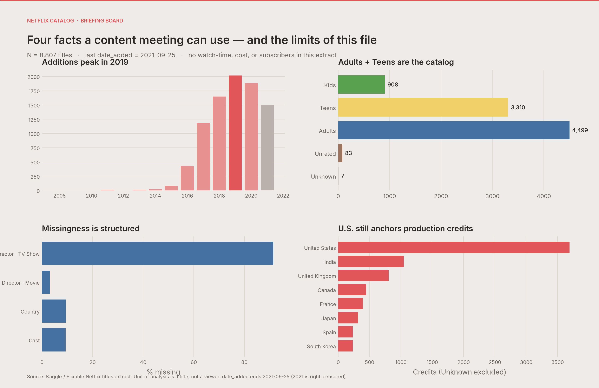
</p>
<p align="center"><sub>Figure 5. Publication briefing board (Python) — four facts a content meeting can use, with the limits of the file on the same canvas.</sub></p>

<p align="center">
  
</p>
<p align="center"><sub>Figure 6. Tableau prototype · integrated dashboard. Some sheets still rank “Không xác định” as a country.</sub></p>

---

### Task 1 — Catalog growth: library age versus add policy (RQ1, HMW-1)

**Why this question.** “Content by years” on `release_year` answers *how old is the library*. Policy (when Netflix chose to carry a title) lives on `date_added`. Both belong in the argument; pooling them is a construct error.

**Data abstraction**

| Attribute | Type | Grain |
|---|---|---|
| `release_year` | O (year) | title |
| `year_added` | O (year) | title (`date_added` parsed; 10 nulls) |
| `type` | N | title |
| Count of titles | Q | title |

**Task abstraction (Munzner).** Analyze → Consume → **Present** a trend; Search → **Explore** (no lookup of a single title); Query → **Summarize** counts by year × type. Action–target: *present trends* and *compare* Movie vs TV Show.

**Idiom.** Stacked area (library age) and bars (add-year). Mark: area / bar. Channels: O → horizontal position; Q → vertical position (aligned, highest ranked perceptual task); N → hue (Movie `#E15658`, TV `#F28B25`).

**Expressiveness / effectiveness.** Position on a common scale expresses Q without the pie-chart angle error the studio PDF accidentally described for this task. Color is used only for a two-level categorical split (separable). 2021 on the add-year chart is encoded in gray and annotated as right-censored so the idiom does not *express* a collapse the data cannot support.

<table>
<tr>
<th align="center" width="50%">Tableau</th>
<th align="center" width="50%">Python</th>
</tr>
<tr>
<td align="center" width="50%">
<br/>
<sub>Tableau · Content by years (<code>release_year</code>)</sub>
</td>
<td align="center" width="50%">
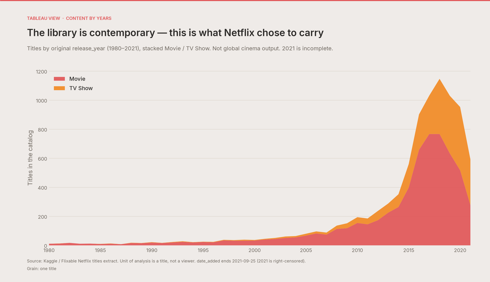<br/>
<sub>Python · same clock, Movie / TV Show stack</sub>
</td>
</tr>
</table>
<p align="center"><sub>Figure 7. Dual evidence for library age.</sub></p>

<p align="center">
  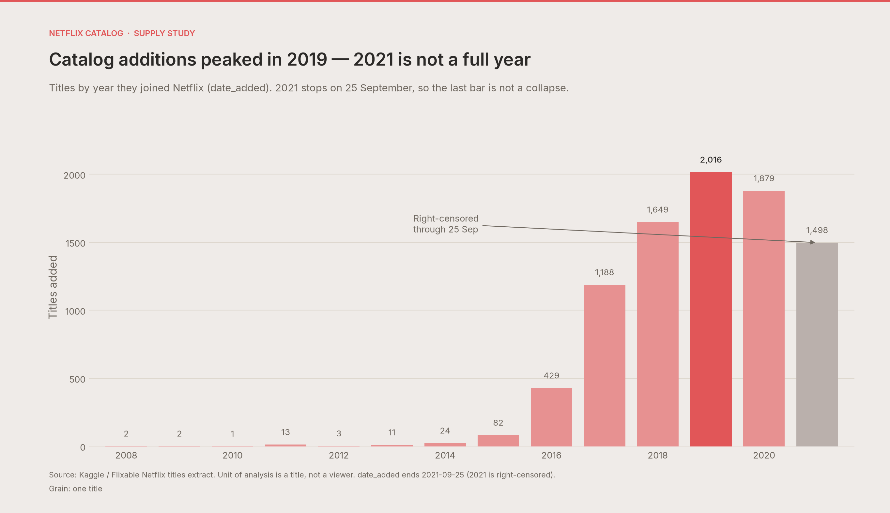
</p>
<p align="center"><sub>Figure 8. Python-only companion: the commissioning clock (<code>date_added</code>) the Tableau sheet did not isolate as a sentence title. Peak = 2019 (2,016). 2021 = 1,498 through 25 September.</sub></p>

**Observation.** `date_added` peaks in 2019. `release_year` is contemporary-heavy with a long left tail of licensed older films. Movies dominate the stack in both clocks; TV Shows rise after the mid-2010s but never overtake.

**Inference.** Do not read “content by years” as cinema output. It is what Netflix chose to carry. Add-year is expansion tempo.

**Non-claim.** Not global production volume. 2021 cannot be compared to 2019 without an annualization this file does not support.

| Year of `date_added` | Titles added |
|---:|---:|
| 2016 | 429 |
| 2017 | 1,188 |
| 2018 | 1,649 |
| **2019** | **2,016** |
| 2020 | 1,879 |
| 2021 (through 25 Sep) | 1,498 |

---

### Task 2 — Production geography (RQ2, HMW-2)

**Why.** Concentration is a strategy claim only if missingness is visible.

**Data abstraction.** `country_credit` (N, exploded); `type` (N); count of credits (Q). Grain = one (`show_id`, country). A US–India co-production is two rows. 831 titles with null country contribute **zero** rows in the publication ranking.

**Task.** Present ranking; explore concentration; summarize Top 10. Choropleth: present spatial distribution (Q → color on a map; location → position).

**Idiom.** Horizontal stacked bars (ranking) + choropleth (geography). Ranking uses aligned length — appropriate for Top 10 comparison. A map is the right form for *where*, but a poor form for *how much* (area and projection distort); hence both idioms.

**Studio failure.** Ranking Unknown / `Không xác định` as country #3. Python excludes it and writes the 9.4% into the subtitle.

<table>
<tr>
<th align="center" width="50%">Tableau</th>
<th align="center" width="50%">Python</th>
</tr>
<tr>
<td align="center" width="50%">
<br/>
<sub>Tableau · Top 10 (Unknown still in the extract)</sub>
</td>
<td align="center" width="50%">
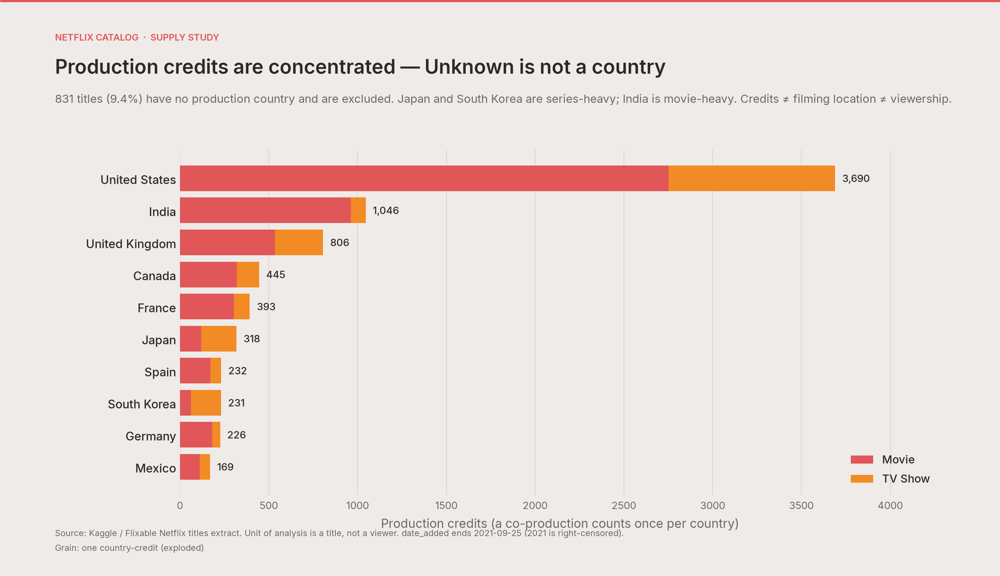<br/>
<sub>Python · Unknown excluded (831 titles / 9.4%)</sub>
</td>
</tr>
</table>
<p align="center"><sub>Figure 9. Dual evidence for production-credit ranking.</sub></p>

<p align="center">
  
</p>
<p align="center"><sub>Figure 10. Tableau-only companion: choropleth of production credits. The map is the right geographic idiom; Figure 9 is the honest ranking. Color is a sequential red (not rainbow).</sub></p>

**Observation.** United States 3,690 · India 1,046 · United Kingdom 806. If missing country is promoted to a nation label, **Unknown ranks third (831)**. Japan and South Korea are series-heavy; India is movie-heavy.

**Inference.** Local-for-global is a long tail of credits, not a dethroning of the U.S.

**Non-claim.** Credit ≠ filming location ≠ the market that watched it. The studio dictionary’s “countries where the movie was filmed” is false on this field.

---

### Task 3 — Genre tags over time (RQ4, HMW-4)

**Data abstraction.** `genre` (N, 42 tags); `year_added` (O); incidences (Q). Grain = one (`show_id`, tag). International Movies = 2,752 **tag incidences**, not 2,752 exclusive titles.

**Task.** Explore trends; summarize top tags; present a readable series (not 42 equally loud lines).

**Idiom.** Polylines. Channel: O → x, Q → y, N → color **for five highlights**; remaining series in muted gray (`#D5D0C8`). The studio spaghetti uses fully saturated color for every tag (low discriminability). Publication mutes the long tail — an effectiveness fix, not a data change.

<table>
<tr>
<th align="center" width="50%">Tableau</th>
<th align="center" width="50%">Python</th>
</tr>
<tr>
<td align="center" width="50%">
<br/>
<sub>Tableau · Trend in publishing genres</sub>
</td>
<td align="center" width="50%">
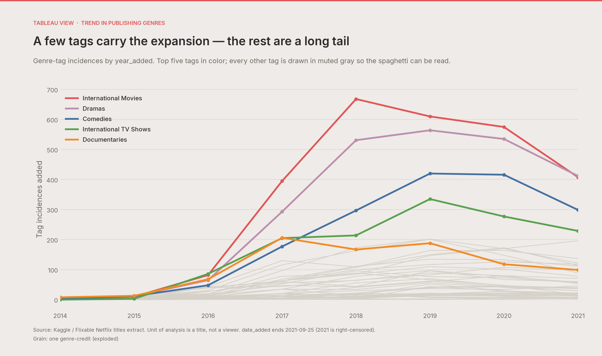<br/>
<sub>Python · top five in color, long tail muted</sub>
</td>
</tr>
</table>
<p align="center"><sub>Figure 11. Dual evidence for genre-tag trends (exploded grain).</sub></p>

<p align="center">
  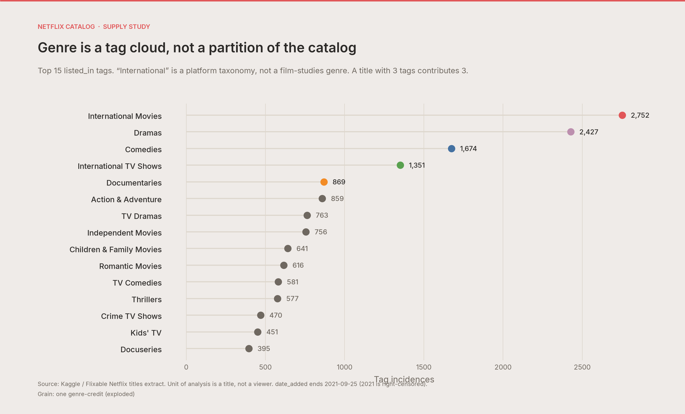
</p>
<p align="center"><sub>Figure 12. Python ranking of tag incidences (Top 15). International Movies 2,752 · Dramas 2,427 · Comedies 1,674.</sub></p>

**Observation.** A few tags carry the 2016–2019 expansion; the rest are a long tail. Mean tags per title = 2.19.

**Inference.** “International” is a platform taxonomy. Drama + comedy are the mass spine.

**Non-claim.** Tag growth ≠ audience growth.

---

### Task 4 — Maturity mix (RQ3, RQ5, HMW-3)

**Data abstraction.** `rating` (N, ordered for display along the parental-guideline ladder); `maturity_band` (N, derived); count of titles (Q). Grain = title.

**Task.** Present distribution; compare bands; summarize family-adjacent share.

**Idiom.** Vertical bars. Q → aligned bar height (accurate); band → hue (Kids green, Teens gold, Adults blue). The studio sheet uses a single red for every rating, which **fails to express the band grouping** the analysis then claims in prose.

<table>
<tr>
<th align="center" width="50%">Tableau</th>
<th align="center" width="50%">Python</th>
</tr>
<tr>
<td align="center" width="50%">
<br/>
<sub>Tableau · Number of content by rating</sub>
</td>
<td align="center" width="50%">
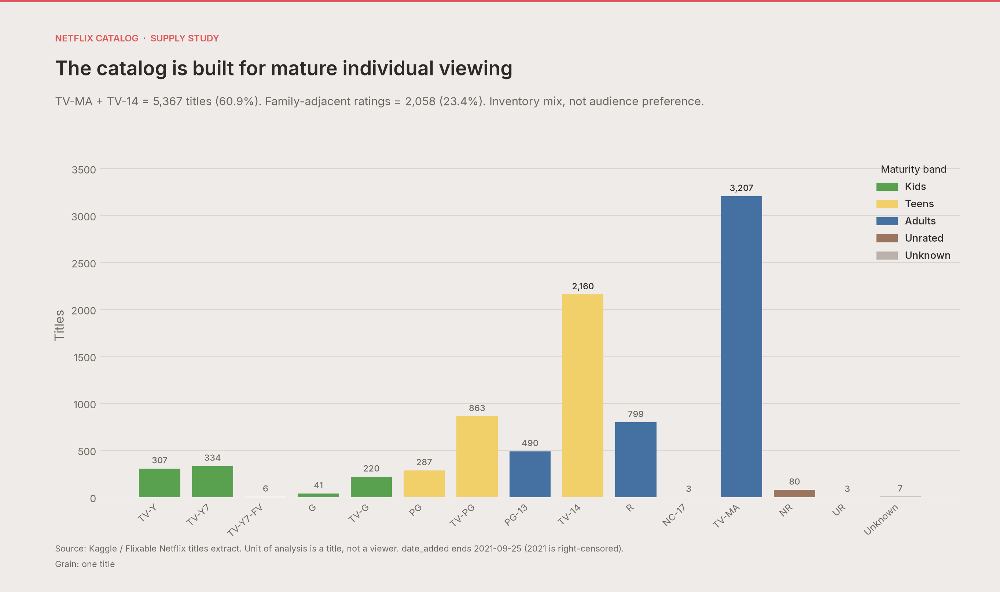<br/>
<sub>Python · recoded ratings, maturity bands</sub>
</td>
</tr>
</table>
<p align="center"><sub>Figure 13. Dual evidence for title-level maturity mix.</sub></p>

**Observation.** TV-MA 3,207 · TV-14 2,160. Family-adjacent = 2,058 (**23.4%**). Adults 4,499 + Teens 3,310 dominate; Kids 908.

**Inference.** The 2021 catalog is positioned as a teen/adult destination. Disney+ contrast is a *positioning* claim, not a measurement of Disney’s library.

**Non-claim.** “Users are mostly adults” does not follow from inventory mix. `rating` is not a quality score. The three `66/74/84 min` “ratings” in the studio chart are recoded runtimes.

---

### Task 5 — Maturity over time (RQ3)

**Data abstraction.** `release_year` or `year_added` (O); `maturity_band` (N); count (Q). Grain = title.

**Task.** Present composition over time; explore whether the mature skew is recent.

**Idiom.** Stacked area / stacked bars. Same band hues as Task 4 for **identity consistency** across the paper (a grammar the studio line chart of 18 ratings violates).

<table>
<tr>
<th align="center" width="50%">Tableau</th>
<th align="center" width="50%">Python</th>
</tr>
<tr>
<td align="center" width="50%">
<br/>
<sub>Tableau · Ratings over release years (18 series)</sub>
</td>
<td align="center" width="50%">
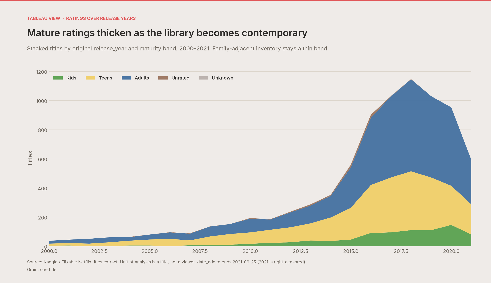<br/>
<sub>Python · five bands, 2000–2021</sub>
</td>
</tr>
</table>
<p align="center"><sub>Figure 14. Dual evidence for maturity over original release year.</sub></p>

<p align="center">
  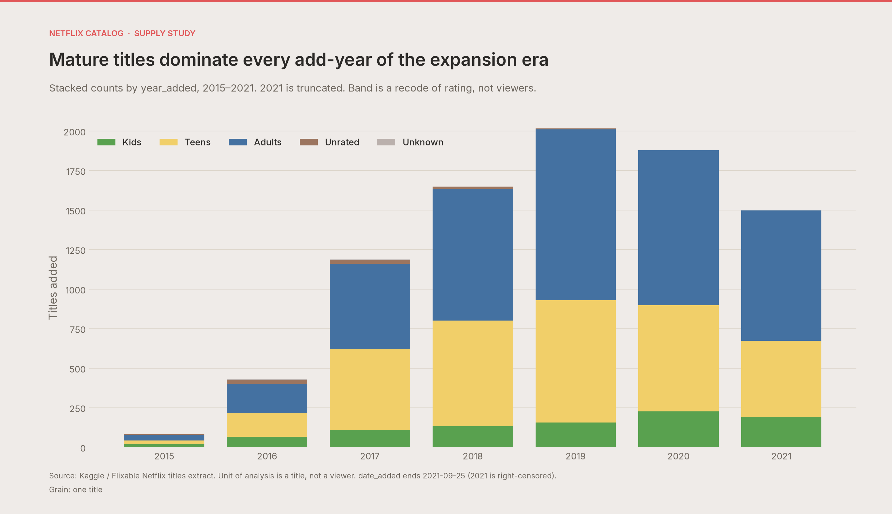
</p>
<p align="center"><sub>Figure 15. Python companion on the add-year clock (2015–2021). Mature bands dominate every expansion year.</sub></p>

**Observation.** Family-adjacent inventory stays a thin band as the library becomes contemporary.

**Inference.** The mature position is not an accident of a single year.

**Non-claim.** Not “the audience got older.”

---

### Task 6 — Rating × genre is a cross-tab, not a correlation (RQ4)

**Data abstraction.** `rating` (N); `genre` (N); cell = count of (`show_id`, tag) pairs (Q).

**Task.** Present a matrix; explore which cells dominate; summarize modal inventory cell.

**Idiom.** Heatmap. Two categorical positions + Q → sequential lightness/hue. Named **cross-tab**. The studio filename says “correlations”; **no coefficient is computed**. Color is cream → coral → Movie red, not rainbow (rainbow is not monotonic; it fails expressiveness for Q).

<table>
<tr>
<th align="center" width="50%">Tableau</th>
<th align="center" width="50%">Python</th>
</tr>
<tr>
<td align="center" width="50%">
<br/>
<sub>Tableau · filename claims “correlations”</sub>
</td>
<td align="center" width="50%">
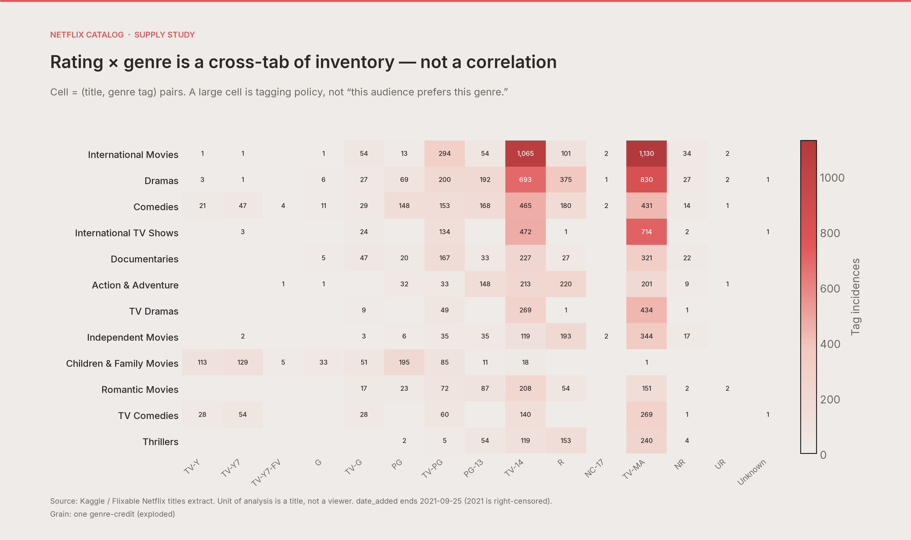<br/>
<sub>Python · named as a cross-tab</sub>
</td>
</tr>
</table>
<p align="center"><sub>Figure 16. Dual evidence for rating × genre. Grain = genre-credit.</sub></p>

**Observation.** TV-MA × International Movies = 1,130 incidences; TV-14 × International Movies = 1,065.

**Inference.** Mature international drama is the modal *inventory* cell.

**Non-claim.** Cell size is tagging policy, not taste affinity.

---

### Task 7 — Cast name-tokens by genre

**Data abstraction.** Sum of parsed cast-list lengths by genre tag (Q); `genre` (N). Grain = (genre tag × cast name-token). 825 titles with missing cast are excluded from the sum.

**Task.** Present a ranking of accumulated names; explore format (ensemble vs lean).

**Idiom.** Horizontal bars. Q → length. Color reuses the genre highlight set for consistency, not a 42-hue rainbow.

<table>
<tr>
<th align="center" width="50%">Tableau</th>
<th align="center" width="50%">Python</th>
</tr>
<tr>
<td align="center" width="50%">
<br/>
<sub>Tableau · Cast × listed in</sub>
</td>
<td align="center" width="50%">
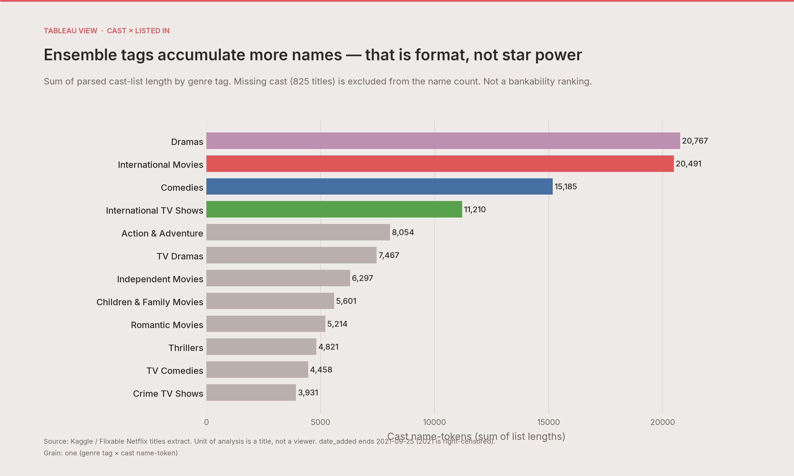<br/>
<sub>Python · name-tokens; missing cast excluded</sub>
</td>
</tr>
</table>
<p align="center"><sub>Figure 17. Dual evidence for cast-token volume by genre tag.</sub></p>

**Observation.** Dramas and International Movies accumulate the most parsed names.

**Inference.** That is **format** (ensemble drama) more than star power.

**Non-claim.** Not a talent graph or bankability ranking until names are resolved and credited uniquely.

---

### Task 8 — Missingness as a KPI (Python-only diagnostic)

The course workbook never isolated missingness as a view. Test required it.

**Data abstraction.** Field ∈ {director, country, cast} (N); `type` (N); percent null (Q, 0–100). Grain = title.

**Idiom.** Grouped horizontal bars. Q → length (so 91.4% vs 3.1% is readable to a percentage point).

<p align="center">
  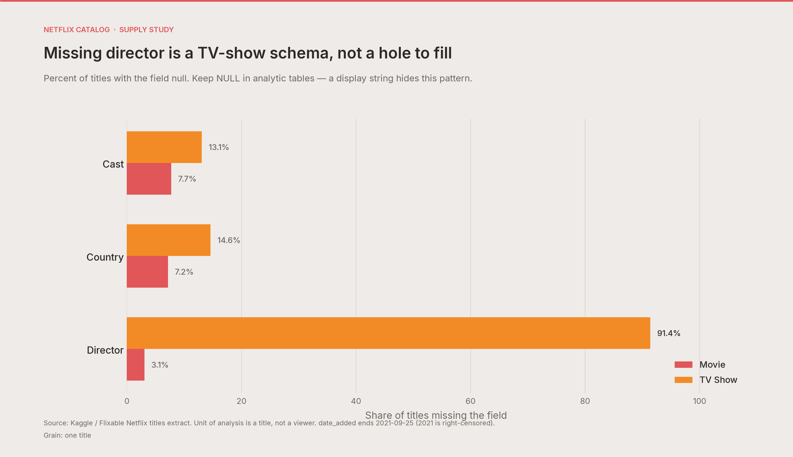
</p>
<p align="center"><sub>Figure 18. Python-only: percent missing by field and type. No Tableau pair — the studio extract filled blanks and then profiled “100% complete.”</sub></p>

**Observation.** Director missing for 91.4% of TV Shows vs 3.1% of Movies.

**Inference.** TV-show director is a schema/practice difference, not a hole to fill.

**Non-claim.** Completeness of metadata is not a quality score for the title.

---

## 7. Synthesis

Design Thinking is supposed to end in a **sharper problem**, not a longer slide of recommendations.

### 7.1 What survived Test

1. The catalog is a designed **maturity position**. TV-MA + TV-14 dominance is too large to be a tagging accident.  
2. The growth era is **dated**. Additions scale from 2016, peak in 2019, and cannot be scored for full-year 2021.  
3. Geography is a **hub-and-spoke credit structure** with a material unknown class (9.4%) that, if promoted, ranks third.  
4. Genre must be modeled as **multi-label**. Any “top genre” chart is an incidence chart.  
5. Family coverage is a **supply** question this file can answer; family *demand* is not.

### 7.2 Implications (scoped to people who own catalogs)

| Horizon | Move | Why this file supports it | What you must still measure |
|---|---|---|---|
| Immediate | Missingness dashboards (`country`, `director` by `type`) | Missingness is large and structured | Nothing — this is free |
| Immediate | Stop ranking Unknown as a country | 831 rows | — |
| Near | Family-adjacent coverage monitor | 23.4% family-adjacent ratings | Household accounts, kids profiles, co-viewing |
| Near | Treat India / Korea / Japan as format-different poles | Type × country stacks | Cost per hour, export hours watched |
| Later | Join even a 1% viewing sample before ROI language | Current file cannot | Views, completion, retention, cost |

<p align="center">
  
</p>
<p align="center"><sub>Figure 19. Competitive landscape is context for Empathize. Subscriber and ARPU figures are not estimated here.</sub></p>

---

## 8. What this study does not claim

A 10/10 data study is defined as much by **refused inferences** as by charts.

| Tempting sentence | Why it is invalid on this file |
|---|---|
| “Teens prefer anime / adults prefer drama” | No viewers, no ages. `maturity_band` is a title-level recode of `rating` |
| “Netflix should cut volume and chase ROI” | No cost, no hours viewed, no LTV |
| “Korea is winning because K-content is popular” | Title credits, not hours watched, and not post-*Squid Game* 2021–22 demand |
| “Disney+ beats Netflix with families” | Disney’s catalog is not in the data |
| “Ratings measure quality” | `rating` is a maturity label; three duration-swap rows are recoded |
| “The map is where titles were filmed” | Production credits, often co-production |
| “2021 was a collapse year” | Right-censored at 25 September |

---

## 9. Threats to validity

| Threat | How it shows up | Mitigation |
|---|---|---|
| **Construct** | Tags as taste; `rating` as quality; `maturity_band` as viewers | Section 8; codebook; tests |
| **Internal** | Reading `release_year` as Netflix strategy | Prefer `date_added` as the policy clock |
| **External** | Snapshot ends 2021-09-25; no ad-tier, games, or 2022–2026 originals | Bound every claim to “in this extract” |
| **Measurement** | Multi-label and multi-country explode inflate counts | Always state grain |
| **Processing** | Localized fill-ins leak into Top 10 | Analytic NULL; Python ranking excludes Unknown |
| **Selection** | Kaggle/Flixable ≠ Netflix title master; regional catalogs differ | Do not treat *N* = 8,807 as “the global product” |
| **Record identity** | Two `show_id`s share one `Consequences` record | Flagged; not treated as two titles in narrative counts of “unique works” |

---

## 10. Reproducibility

```bash
python -m pip install -r requirements.txt
python -m pytest -q          # 10 wrangling invariants
python -m netflix_catalog    # gold tables + quality report + figures/viz_*.png
```

| Artifact | Path |
|---|---|
| Analytic titles | `data/processed/netflix_titles.csv` |
| Tableau extract | `data/processed/netflix_titles_tableau.csv` |
| Quality report | `docs/DATA_QUALITY.md` |
| Dictionary | `docs/DATA_DICTIONARY.md` |
| Viz spec | `docs/VIZ_SPECS.md` |
| Workbook | `Tableau/Netflix & TV Show.twbx` |

Open the prototype in Tableau Desktop / Tableau Public. Point a refresh at `data/processed/netflix_titles_tableau.csv`. Alias `Unknown` as “No production country” and keep it out of Top 10.

---

## References

Bansal, S. (2021). *Netflix Movies and TV Shows* [Data set]. Kaggle. https://www.kaggle.com/shivamb/netflix-shows

Cleveland, W. S., & McGill, R. (1984). Graphical perception: Theory, experimentation, and application to the development of graphical methods. *Journal of the American Statistical Association, 79*(387), 531–554.

Hasso Plattner Institute of Design at Stanford. (2018). *Design Thinking Bootleg*.

Lotz, A. D. (2017). *Portals: A treatise on internet-distributed television*. Michigan Publishing.

Mackinlay, J. (1986). Automating the design of graphical presentations of relational information. *ACM Transactions on Graphics, 5*(2), 110–141.

Munzner, T. (2014). *Visualization analysis and design*. CRC Press.

Rubin, D. B. (1976). Inference and missing data. *Biometrika, 63*(3), 581–592.

Tufte, E. R. (2001). *The visual display of quantitative information* (2nd ed.). Graphics Press.

---

## Appendix A — Errata of the original studio PDF

| Original claim | Correction |
|---|---|
| `country` = filming location | Production credits, often multi-valued |
| `rating` = audience reviews | Parental-guideline / MPAA-style maturity label |
| `date_added` = released on Netflix as cinematic release | Catalog-entry date |
| Mean-impute numeric blanks | No meaningful float; `duration` is typed text |
| Fill objects then report 100% completeness | Hides MNAR/structural missingness |
| `Không xác định` as a Top-10 country | 831 missing credits; exclude from ranking |
| `66 min` / `74 min` / `84 min` as ratings | Duration leaked into `rating` (Louis C.K.); recoded |
| Heart-disease / gender / cholesterol sentences in idiom evaluation | Copy-paste from the assignment example; deleted |
| Pie-chart evaluation attached to a bar idiom | Idiom and evaluation now match |
| Duplicate title = remake | Two identical `Consequences` records (same credits and synopsis) |
| Teen band includes `PG-13` | `PG-13` coded Adults; `family_adjacent` excludes `TV-14` |
| Map idiom described as “line chart” | Choropleth; Q → sequential color |

---

## Appendix B — Figure index (Tableau ↔ Python)

| Fig. | Tableau export | Python publication |
|---|---|---|
| 5–6 | Dashboard.png | `viz_08_briefing_board.png` |
| 7–8 | Content by years.png | `viz_09_library_by_release_year.png` + `viz_01_catalog_additions.png` |
| 9–10 | Top 10 producing countries.png + choropleth | `viz_04_producing_countries.png` |
| 11–12 | Trend in publishing over years.png | `viz_10_genre_trends.png` + `viz_05_genre_incidence.png` |
| 13 | Number of Content followed by rating.png | `viz_03_maturity_mix.png` |
| 14–15 | Number of rating's content years.png | `viz_11_rating_over_release_year.png` + `viz_07_maturity_over_add_year.png` |
| 16 | Age rating category correlations.png | `viz_06_rating_genre_crosstab.png` |
| 17 | Distribution cast with different listed in.png | `viz_12_cast_by_genre.png` |
| 18 | — (not in workbook) | `viz_02_missingness_by_type.png` |

---

<sub>One-sentence contribution: we specified who the catalog is for, wrote a POV that can be wrong, killed inferences the file cannot support, and left a prototype that makes those limits visible.</sub>
